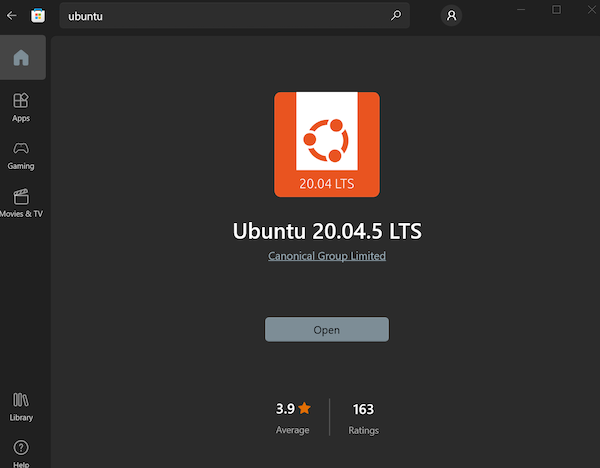
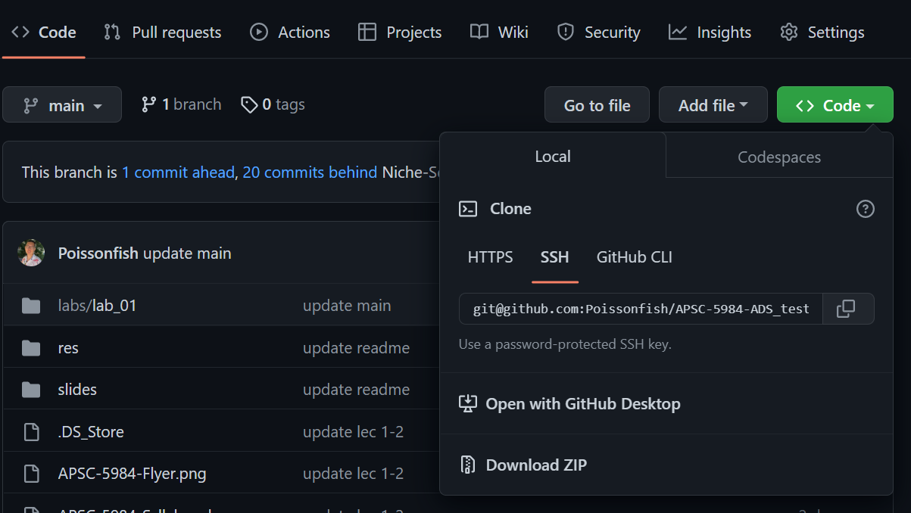
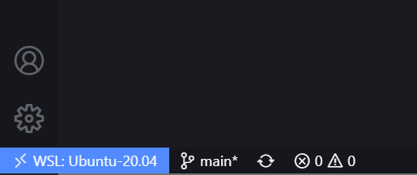
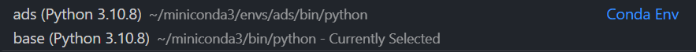
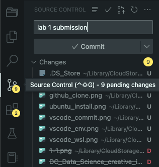

# APSC-5984 Lab 1: Environment Setup

Due: 2023-01-23 (Monday) 23:59:59

- [APSC-5984 Lab 1: Environment Setup](#apsc-5984-lab-1-environment-setup)
  - [0. Overview](#0-overview)
  - [1. Unix Command-line Environment](#1-unix-command-line-environment)
    - [1.1 Mac users](#11-mac-users)
    - [1.2 Windows users](#12-windows-users)
  - [2. Miniconda](#2-miniconda)
    - [2.1 Mac users](#21-mac-users)
    - [2.2 Windows users](#22-windows-users)
  - [3. Jupyter Notebook](#3-jupyter-notebook)
  - [4. Visual Studio Code](#4-visual-studio-code)
    - [4.1 Installation](#41-installation)
    - [4.2 Essential extensions](#42-essential-extensions)
  - [5. Create a GitHub account](#5-create-a-github-account)
  - [6. Install Git and configure it with your GitHub account](#6-install-git-and-configure-it-with-your-github-account)
    - [6.1 Install Git](#61-install-git)
    - [6.2 Manage your Git username and email](#62-manage-your-git-username-and-email)
    - [6.3 Manage your SSH keys](#63-manage-your-ssh-keys)
  - [7. Submit the assignment](#7-submit-the-assignment)
    - [7.1 Fork the course repository](#71-fork-the-course-repository)
    - [7.2 Clone the course repository to your local machine](#72-clone-the-course-repository-to-your-local-machine)
    - [7.3 Share your repository with the instructor](#73-share-your-repository-with-the-instructor)
    - [7.4 Open VS Code](#74-open-vs-code)
    - [7.5 Navigate to the lab assignment folder](#75-navigate-to-the-lab-assignment-folder)
    - [7.6 Open the main notebook](#76-open-the-main-notebook)
    - [7.7 Run the lab assignment](#77-run-the-lab-assignment)
    - [7.8 Submit the lab assignment](#78-submit-the-lab-assignment)

## 0. Overview

In this lab, you will set up your development environment. The procedure may vary depending on your operating system. Please follow the instruction carefully and ask for help if you have any questions.

After completing this lab, you are asked to push a Jupyter Notebook, which you will write a simple Python program, to your GitHub repository. This will be used to verify that you have completed the lab.

[(Back to top)](#apsc-5984-lab-1-environment-setup)

## 1. Unix Command-line Environment

### 1.1 Mac users

If you are using a Mac, you can use the built-in Terminal app. You can find it in the `Applications/Utilities` folder. We suggest you to pin it to the dock for easy access.

### 1.2 Windows users

1. If you are using a Windows machine, you are recommended to use Windows Subsystem for Linux (WSL) (https://docs.microsoft.com/en-us/windows/wsl/install-win10) to set up a unix command-line environment. Open `PowerShell` and run the following command to enable WSL:

    ```shell
    wsl --install
    ```

2. Then, install a Linux distribution (we will use Ubuntu 20.04.5 LTS) from Windows Store.



1. After installing WSL, you can verify the installation in the Start menu or search for "Ubuntu" in the search bar. This will open a terminal window (hereinafter referred to as `terminal`).

2. Open `File Explore` and on the sidebar you should see a new drive called `Linux`. This is the Linux file system you will interact throughout the course. You are encouraged to pin the directory `/Linux/Ubuntu-20.04/home/<your user name>` (hereinafer referred to as `home` folder) to the taskbar for easy access.

[(Back to top)](#apsc-5984-lab-1-environment-setup)

## 2. Miniconda

Quoted from the Miniconda website:
> Miniconda is a free minimal installer for conda. It is a small, bootstrap version of Anaconda that includes only conda, Python, the packages they depend on, and a small number of other useful packages, including pip, zlib and a few others. Use the `conda install` command to install 720+ additional conda packages from the Anaconda repository.

### 2.1 Mac users

Download the correct version for your operating system to install Miniconda from https://docs.conda.io/en/latest/miniconda.html

### 2.2 Windows users

1. Go to https://docs.conda.io/en/latest/miniconda.html
2. Choose the **Linux** installer (should be `Miniconda3-latest-Linux-x86_64.sh` or something similar) and put it in your `home` folder.
3. run `bash Miniconda3-latest-Linux-x86_64.sh` in the terminal to install Miniconda.
4. Close and reopen the terminal to activate the changes.

To verify if you have installed Miniconda correctly, you can type `conda -V` in the terminal and you should see the installed version of Miniconda.

```bash
(base) user@DESKTOP-XXXXXX:~$ conda -V
conda 22.11.1
```

[(Back to top)](#apsc-5984-lab-1-environment-setup)

## 3. Jupyter Notebook

Jupyter Notebook is a web-based interactive computing platform. It allows you to create and share documents that contain live code, equations, visualizations and narrative text. It is widely used in data science and machine learning. You can find more information about Jupyter Notebook (https://jupyter.org/)

Thanks to the power of Miniconda, you can install Jupyter Notebook with a single command:

```bash
conda install -c conda-forge notebook
```

Again, to check if you have installed Jupyter Notebook correctly, you can type `jupyter --version` and you should see the version information.

```bash
(base) user@DESKTOP-XXXXXX:~$ jupyter --version
Selected Jupyter core packages...
IPython         : 8.7.0
ipykernel       : 6.19.4
ipywidgets      : not installed
jupyter_client  : 7.3.4
...
```

[(Back to top)](#apsc-5984-lab-1-environment-setup)

## 4. Visual Studio Code

Visual Studio Code (VS Code) is a free and open-source source-code editor developed by Microsoft for Windows, Linux and macOS. It includes support for debugging, embedded Git control and GitHub, syntax highlighting, intelligent code completion, snippets, and code refactoring.

### 4.1 Installation

The installation is pretty straightforward. Please follow the instruction on the VS Code website (https://code.visualstudio.com/). Windows users can download the Windows installer for WSL, no need to install the Linux version.

### 4.2 Essential extensions

After installing VS Code, you can open it and install the following required extensions:

- `WSL`: (Required for Windows users) This extension allows you to open a terminal in WSL from VS Code.
- `Python`: This extension adds rich support for Python to VS Code, including features such as IntelliSense, linting, debugging, code navigation, code formatting, Jupyter notebook support, refactoring, variable explorer, test explorer, snippets, and more.
- `Pylance`: This extension provides a fast, feature-rich language server for Python to check your code for errors and provide code completion.
- `Jupyter`: This extension allows you to run Jupyter Notebook in VS Code.
- `Markdown All in One`: This extension provides all you need to write Markdown (keyboard shortcuts, table of contents, auto preview and more). This lab assignment was written in Markdown.

Optional extensions:

- `Atom keymap`: This extension allows you to execute commands in VS Code using Atom keymap.
- `Project Manager`: This extension allows you to manage your projects in VS Code. You will use this extension to organize our lab assignments.
- Color Theme for icon and script: You can choose any color theme you like. We suggest you to use `One Dark Pro` or `Monokai Pro`.

[(Back to top)](#apsc-5984-lab-1-environment-setup)

## 5. Create a GitHub account

Please use VT email to register a GitHub account (https://github.com/). We will use GitHub to submit the lab assignments throughout the semester.

[(Back to top)](#apsc-5984-lab-1-environment-setup)

## 6. Install Git and configure it with your GitHub account

### 6.1 Install Git

Same as Jupyter Notebook, you can install Git with a single command:

```bash
conda install -c conda-forge git
```

And check if you have installed Git correctly:

```bash
(base) user@DESKTOP-XXXXXX:~$ git --version
git version 2.34.1
```

### 6.2 Manage your Git username and email

After installing Git, you need to configure it with your GitHub account. You can follow the instruction here https://docs.github.com/en/get-started/getting-started-with-git/setting-your-username-in-git?platform=mac

Set up global username and email for all repositories

```bash
# Don't need to include the arrow signs  "< >"
git config --global user.name <your username>
git config --global user.email <your email>
```

Verify the information

```bash
git config user.name
git config user.email
```

### 6.3 Manage your SSH keys

SSH keys are used to authenticate you to GitHub without using your username and password. You can find the instruction here: https://docs.github.com/en/authentication/connecting-to-github-with-ssh/generating-a-new-ssh-key-and-adding-it-to-the-ssh-agent?platform=mac

In the terminal, type the following command to generate a new SSH key
:

```bash
ssh-keygen -t ed25519 -C "your_email@example.com"
```

You will be asked to enter a file in which to save the key. Press Enter to accept the default file location. You will also be asked to enter a passphrase. You can choose to enter a passphrase or just press Enter to skip it. You will see the following message if you successfully generate a new SSH key:

```bash
Your identification has been saved in /home/<username>/.ssh/id_ed25519
...
```

Add your SSH private key to the ssh-agent.

```bash
eval "$(ssh-agent -s)"
# Agent pid 59566
```

Finally, add the new SSH key to your GitHub account. Please follow the official instruction (https://docs.github.com/en/authentication/connecting-to-github-with-ssh/adding-a-new-ssh-key-to-your-github-account?tool=webui) to finish this step. To get the SSH key you are asked to paste into GitHub, you can type the following command:

```bash
cat ~/.ssh/id_ed25519.pub
# ssh-ed25519 AAAAC3NzaC1lZDI1NTE5AAAAI...
```

[(Back to top)](#apsc-5984-lab-1-environment-setup)

## 7. Submit the assignment

### 7.1 Fork the course repository

Go to the course repository (https://github.com/Niche-Squad/APSC-5984-ADS). Click the `Fork` button on the top right corner. You will see a copy of the course repository in your GitHub account.

### 7.2 Clone the course repository to your local machine

Go to your forked repository. Click the "Code" green button and copy the SSH URL (not HTTPS URL). Open the terminal and navigate to the directory where you want to clone the repository.



Then, type the following command to clone the repository to your local machine:

```bash
git clone git@github.com:<your username>/APSC-5984-ADS.git
```

### 7.3 Share your repository with the instructor

Go to your forked repository. Click the "Settings" button. On the left side, click "Collaborators and teams". Click "Add people" and search the instructor's username `poissonfish`. Grant a `Write` permission and click "Add poissonfish to this repository". It will allows the instructor to view your repository and give you feedback.

### 7.4 Open VS Code

Open VS Code as other applications if you are on Mac.

ATTENTION, if you are a Windows user, open the WSL `terminal` and type `code` to open VS Code to let you work in the Linux environment instead of the Windows environment.

```bash
code
```

You will see "WSL:Ubuntu-20.04" on the bottom left corner when you open VS Code in WSL.



### 7.5 Navigate to the lab assignment folder

In VS code, click the `File` menu and click `Open Folder`. Navigate to the folder of the lab assignment you want to work on.

### 7.6 Open the main notebook

On the left side, you will see EXPLORER where you can navigate through the files and folders. Open the file `labs/lab_01/assignment.ipynb` to start a Jupyter Notebook session.

### 7.7 Run the lab assignment

Before you run the scripts, make sure your kernel is set to the Conda version of Python. You can check the kernel by clicking the button on the top right corner of the notebook. It should be set to something similar to `base (Python 3.10.x) ~/miniconda3/bin/python`. Finally, click the `Run All` button on the top menu bar to run the lab assignment.



### 7.8 Submit the lab assignment

After you finish the lab assignment, you need to push the changes to your GitHub repository. In VS code, you can click the `Source Control` button on the left side. You will see the changes you made to the files. Enter a commit message "lab 1 submission" and click the `Commit` button to commit the change. Finally, click the `Push` button to push the changes to your GitHub repository. And you are done for this lab assignment!



[(Back to top)](#apsc-5984-lab-1-environment-setup)