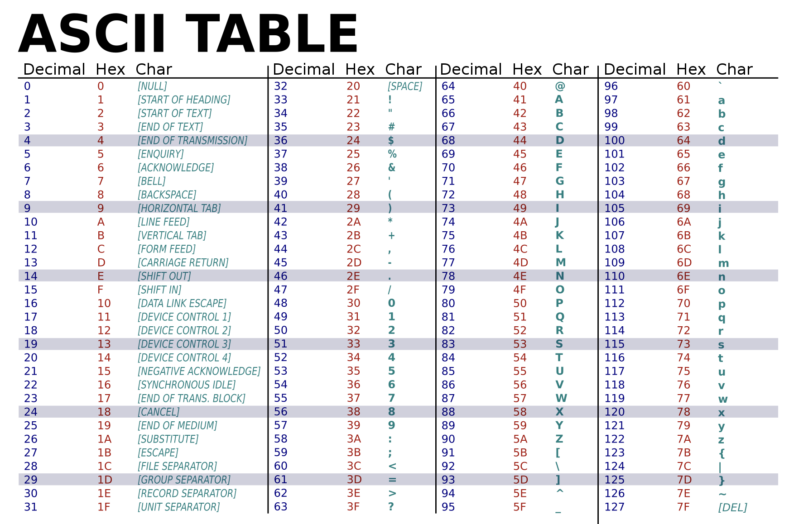

# APSC-5984 Lab 2: Python Basics I

Due: 2023-01-30 (Monday) 23:59:59

- [APSC-5984 Lab 2: Python Basics I](#apsc-5984-lab-2-python-basics-i)
  - [0. Overview](#0-overview)
  - [1. Variables](#1-variables)
  - [2. Data Types](#2-data-types)
  - [3. Operators](#3-operators)
    - [3.1 Arithmetic Operators](#31-arithmetic-operators)
    - [3.2 String Operators](#32-string-operators)
    - [3.3 Comparison Operators](#33-comparison-operators)
    - [3.4. Logical Operators](#34-logical-operators)
  - [4. Conditional Statements](#4-conditional-statements)

## 0. Overview

In this lab, you will learn basic Python syntax. We will cover the essential concepts of Python:

- Variables and data types

- Operators

- Control structures: If-else statements

You will need to open the `labs/lab_02/assignment.ipynb` file in VS Code and follow the instruction to complete this lab assignment.

([Back to top](#apsc-5984-lab-2-python-basics-i))

## 1. Variables

There are several rules for naming variables in Python:

- A variable name can only contain letters (`A-Za-z`), numbers(`0-9`), and underscores(`_`).
- A variable name is case sensitive. For example, `first_var` and `First_var` are two different variables.
- There are two ways to name a variable: `snake_case` and `camelCase`. In `snake_case`, all letters are lowercase and words are separated by underscores. In `camelCase`, the first letter of each word is capitalized. For example, `first_var` and `firstVar` are both valid variable names.

Things you cannot do:

- A variable name cannot start with a number.
- A variable name cannot contain spaces.

Examples:

- Valid variable names: `first_var`, `firstVar`, `first_var_1`, `firstVar1`, `first_var_1_2_3`, `firstVar123`
- Invalid variable names: `1st_var`, `first var`, `first-var`

In Python, you can use `=` to assign a value to a variable. For example, you can assign an integer value `3` to a variable `first_var` by running the following code:

```Python
first_var = 3
```

And we can print the value of `first_var` by running the following code:

```Python
print(first_var) # 3
```

[(Back to top)](#apsc-5984-lab-2-python-basics-i)

## 2. Data Types

There are several data types in Python:

- `int`: an integer number, e.g., `3`, `0`, `-1`
- `float`: a floating point number, e.g., `3.14`, `0.0`, `-1.0`
- `bool`: a boolean value, e.g., `True`, `False`
- `str`: a string, e.g., `"hello"`, `"2023-01-30"`

```Python
var_int = 3
var_float = 3.14
var_bool = True
var_str = "hello"
```

You can use `type()` function to check the type of a variable. For example, you can check the type of `a` by running the following code:

```Python
print(type(var_float)) # <class 'float'>
```

It is possible to convert a variable from one type to another. For example, you can convert a `float` to an `int` by running the following code:

From `float` to `int`:

```Python
var_float = 3.14
var_int = int(var_float)
print(var_int) # 3
```

From `int` to `string`:

```Python
var_int = 3
var_str = str(var_int)
print(var_str) # "3"
```

[(Back to top)](#apsc-5984-lab-2-python-basics-i)

## 3. Operators

### 3.1 Arithmetic Operators

In Python, you can use arithmetic operators to perform arithmetic operations. For example, you can use the `+` operator to add two numbers, and use the `-` operator to subtract two numbers. We use `a = 7` and `b = 4` as examples in the following table to illustrate the usage of arithmetic operators.

| Operator | Description | Example | Result |
| :--- | :--- | :--- | :--- |
| `+` | Addition | `a + b` | `11` |
| `-` | Subtraction | `a - b` | `3` |
| `*` | Multiplication | `a * b` | `28` |
| `**` | Exponentiation | `a ** b` | `2401` |
| `/` | Division | `a / b` | `1.75` |
| `//` | Floor division | `a // b` | `1` |
| `%` | Modulus | `a % b` | `3` |

### 3.2 String Operators

You can also use operators to perform operations on strings. For example, you can use the `+` operator to concatenate two strings, and use the `*` operator to repeat a string. We use `a = "hello"` and `b = "world"` as examples in the following table to illustrate the usage of string operators.

| Operator | Description | Example | Result |
| :--- | :--- | :--- | :--- |
| `+` | Concatenation | `a + b` | `"helloworld"` |
| `*` | Repetition | `a * 3` | `"hellohellohello"` |

### 3.3 Comparison Operators

You can use comparison operators to compare two values. For example, you can use the `==` operator to check if two values are equal. We use `a = 7` and `b = 4` as examples in the following table to illustrate the usage of comparison operators.

| Operator | Description | Example | Result |
| :--- | :--- | :--- | :--- |
| `==` | Equal to | `a == b` | `False` |
| `!=` | Not equal to | `a != b` | `True` |
| `>` | Greater than | `a > b` | `True` |
| `<` | Less than | `a < b` | `False` |
| `>=` | Greater than or equal to | `a >= b` | `True` |
| `<=` | Less than or equal to | `a <= b` | `False` |

Similar logic applies to strings. For example, you can use the `==` operator to check if two strings are equal. We use `a = "hello"` and `b = "world"` as examples in the following table to illustrate the usage of comparison operators. We are also able to use the `>` and `<` operators to compare two strings. The comparison is based on the ASCII table and the alphabetical order of the strings. For example, `"hello"` is smaller than `"world"` because the first letter of `"hello"` is `h` (ASCII code 104) is smaller than the first letter of `"world"` is `w` (ASCII code 119).

```Python
a = "hello"
b = "world"
print(a != b) # True
print(a > b) # False
```

ASCII Table from [Wikipedia](https://upload.wikimedia.org/wikipedia/commons/thumb/1/1b/ASCII-Table-wide.svg/1200px-ASCII-Table-wide.svg.png):


### 3.4. Logical Operators

You can use logical operators to perform logical operations. For example, you can use the `and` operator to check if two conditions are both `True`. We use `a = True` and `b = False` as examples in the following table to illustrate the usage of logical operators. It is noted that some operators are interchangeable, e.g., `and` and `&&`.

| Operator | Description | Example | Result |
| :--- | :--- | :--- | :--- |
| `and` | Logical AND | `a and b` | `False` |
| && | Logical AND | `a && b` | `False` |
| `or` | Logical OR | `a or b` | `True` |
| \|\| | Logical OR | `a \|\| b` | `True` |
| `not` | Logical NOT | `not a` | `False` |
| ! | Logical NOT | `!a` | `False` |

[(Back to top)](#apsc-5984-lab-2-python-basics-i)

## 4. Conditional Statements

You can use `if` statement to check a condition. For example, you can check if `10` is greater than `0` by running the following code:

```Python
if 10 > 0:
    print("10 is greater than 0")

# Output:
# 10 is greater than 0
```

It is noted that the Python syntax requires no parentheses around the condition, and the code block in the `if` statement is indented by a tab (4 spaces). Inappropriate indentation will cause syntax errors. For example, the following code will cause a syntax error:

```Python
if 10 > 0:
print("10 is greater than 0")

# Output:
# IndentationError: expected an indented block
```

You can use `else` statement to run a block of code if the previous conditions are not satisfied. Although the `else` statement is optional. It is recommended to use `else` statement to avoid confusion. FOr example, you can check if `7` is even or odd by running the following code:

```Python
if 7 % 2 == 0:
    print("7 is even")
else:
    print("7 is odd")

# Output:
# 7 is odd
```

This code should print `"7 is odd"` because `7` is not divisible by `2`.

When it comes to multiple conditions, you can use `elif` statement to check as many conditions as you want.

```Python
if 27 % 2 == 0:
    print("27 is even")
elif 27 % 3 == 0:
    print("27 is divisible by 3")
else:
    print("27 is neither even nor divisible by 3")

# Output:
# 27 is divisible by 3
```

This code should print `"27 is divisible by 3"` because `27` is divisible by `3` but not `2`.

[(Back to top)](#apsc-5984-lab-2-python-basics-i)
