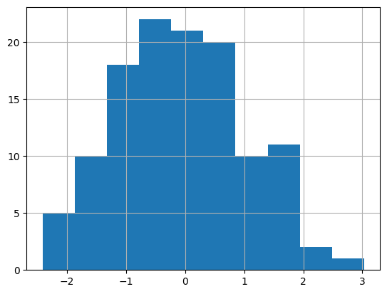
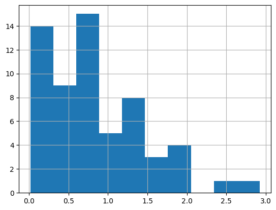
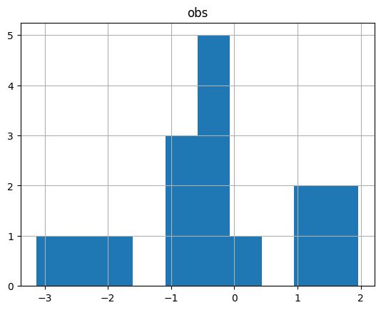

# APSC-5984 Lab 5: Dataframe manipulation

Due: 2023-02-20 (Monday) 23:59:59

## 0. Overview

We will introduce the concept of `DataFrame` in this lab. You will be intstructed to use the Python library `pandas` to manipulate dataframes. First, let's import the library. Conventionally, we import it as `pd`.


```python
import pandas as pd
```

## 1. Data Loading and Saving

We will work on the several files in the `lab_05` folder to practice how to load and save files

### 1.1 CSV and tab-delimited files

#### 1.1.1 Separators

The basic function to load data in `pandas` is `pd.read_csv()`. It can read data from a CSV file or a tab-delimited file. The default delimiter is comma "`,`", but it also allows you to specify other delimiters, such as tab "`\t`".

The file `file_A.csv` is a CSV file with comma as the delimiter:


```python
!cat file_A.csv
```

    id,A,B,C
    a1,1,1,1
    a2,0,1,0
    a3,1,0,1


```python
pd.read_csv('file_A.csv')
```


       id  A  B  C
    0  a1  1  1  1
    1  a2  0  1  0
    2  a3  1  0  1


The file `file_A.csv` was correctly loaded into Python. The dataframe has 3 rows and 4 columns. What if we use the same way to load the file `file_B.txt` that is tab-delimited?


```python
!cat file_B.txt
```

    id	A	B	C
    a1	1	1	1
    a2	0	1	0
    a3	1	0	1


```python
pd.read_csv('file_B.txt')
```


       id\tA\tB\tC
    0  a1\t1\t1\t1
    1  a2\t0\t1\t0
    2  a3\t1\t0\t1


The result was not what we expected. The reason is that the default delimiter is comma, but the file is tab-delimited. We can specify the delimiter as tab "`\t`" to fix the problem.


```python
pd.read_csv('file_B.txt', sep='\t')
```


       id  A  B  C
    0  a1  1  1  1
    1  a2  0  1  0
    2  a3  1  0  1


Great! Noted that `sep` can be any character, such as "`|`", "`;`", "`:`", etc. So, always check the delimiter before loading the file.

#### 1.1.2 Header

In some cases, the first row of the file is not the header. We can use the argument `header` to specify the row number of the header.

This example shows what would happen if we do not specify the header wiht a non-header file `file_A_nh.csv`.


```python
!cat file_A_nh.csv
```

    a1,1,1,1
    a2,0,1,0
    a3,1,0,1


```python
pd.read_csv('file_A_nh.csv')
```


       a1  1  1.1  1.2
    0  a2  0    1    0
    1  a3  1    0    1


The first row was loaded as the header. Here is the fix.


```python
pd.read_csv('file_A_nh.csv', header=None)
```


        0  1  2  3
    0  a1  1  1  1
    1  a2  0  1  0
    2  a3  1  0  1


Some files may be coded with two headers:


```python
!cat file_A_2h.csv
```

    id,A,B,C
    a1,1,1,1
    a2,0,1,0
    a3,1,0,1
    id,D,E,F
    a4,1,1,1
    a5,0,1,0
    a6,1,0,1

If we want the 5th row to be the header, we can use `header=4` (again, it is 0-based).


```python
pd.read_csv('file_A_2h.csv', header=4)
```


       id  D  E  F
    0  a4  1  1  1
    1  a5  0  1  0
    2  a6  1  0  1


### 1.2 Excel spreadsheet (.xlsx)

Excel spreadsheet is a common format for data storage. However, given it is a format that contains multiple sheets, it is not straightforward to load it into a tabular format.

#### 1.2.1 Load a single sheet

Here is an example of using `pd.read_excel()` to load the spreadsheet `file_C.xlsx`:


```python
pd.read_excel('file_C.xlsx')
```


       id  A  B  C
    0  a1  1  1  1
    1  a2  0  1  0
    2  a3  1  0  1


By default, it only loads the first sheet. We can specify the sheet name or the sheet number to load other sheets.


```python
pd.read_excel('file_C.xlsx', sheet_name='Sheet2')
```


       id  D  E  F
    0  a4  0  1  0
    1  a5  0  0  0
    2  a6  1  1  0
    3  a7  2  2  0
    4  a8  3  3  0
    5  a9  4  4  0


```python
pd.read_excel('file_C.xlsx', sheet_name='Sheet3')
```


              A         B
    0  0.631007  0.034287
    1  0.114071  0.370723
    2  0.156949  0.851093
    3  0.051913  0.089328
    4  0.089216  0.861941
    5  0.572473  0.364972
    6  0.452546  0.152391
    7  0.052752  0.024641


### 1.2.2 Dictionary of dataframes

In `pandas`, Excel spreadsheet is loaded as a dictionary of dataframes. The keys are the sheet names, and the values are the dataframes.

To load the entire spreadsheet taht contains all sheets, we can use `pd.read_excel()` with `sheet_name=None`:


```python
data = pd.read_excel('file_C.xlsx', sheet_name=None)
print(data)
```

    {'Sheet1':    id  A  B  C
    0  a1  1  1  1
    1  a2  0  1  0
    2  a3  1  0  1, 'Sheet2':    id  D  E  F
    0  a4  0  1  0
    1  a5  0  0  0
    2  a6  1  1  0
    3  a7  2  2  0
    4  a8  3  3  0
    5  a9  4  4  0, 'Sheet3':           A         B
    0  0.631007  0.034287
    1  0.114071  0.370723
    2  0.156949  0.851093
    3  0.051913  0.089328
    4  0.089216  0.861941
    5  0.572473  0.364972
    6  0.452546  0.152391
    7  0.052752  0.024641}


The sheets might not be displayed well aligned, but you can still see the keys as each sheet name and its corresponding dataframe. You can use the 'lookup' function we learned in the previous lecture to find the dataframe of a specific sheet:


```python
data["Sheet3"]
```


              A         B
    0  0.631007  0.034287
    1  0.114071  0.370723
    2  0.156949  0.851093
    3  0.051913  0.089328
    4  0.089216  0.861941
    5  0.572473  0.364972
    6  0.452546  0.152391
    7  0.052752  0.024641


### 1.3 Save data

#### 1.3.1 Save as CSV

We can use `df.to_csv()` to save a dataframe as a CSV file. Here are parameters that we can use:

- `sep`: the delimiter. Default is comma "`,`".
- `index`: whether to save the index column. Default is `True`.
- `header`: whether to save the header. Default is `True`.
- `columns`: the columns to save. Default is `None` (all columns).
- `mode`: the mode to open the file. Default is `"w"` (write). Other options are `"a"` (append) and `"r"` (read).


```python
data["Sheet1"].to_csv('out_A.csv')
!cat out_A.csv
```

    ,id,A,B,C
    0,a1,1,1,1
    1,a2,0,1,0
    2,a3,1,0,1


```python
data["Sheet1"].to_csv('out_A.csv', index=False)
!cat out_A.csv
```

    id,A,B,C
    a1,1,1,1
    a2,0,1,0
    a3,1,0,1


```python
data["Sheet1"].to_csv('out_A.csv', index=False, header=None)
!cat out_A.csv
```

    a1,1,1,1
    a2,0,1,0
    a3,1,0,1


```python
data["Sheet1"].to_csv('out_A.csv', index=False, header=None, sep='\t')
!cat out_A.csv
```

    a1	1	1	1
    a2	0	1	0
    a3	1	0	1


```python
data["Sheet1"].to_csv('out_A.csv', index=False, columns=['A', 'B'])
!cat out_A.csv
```

    A,B
    1,1
    0,1
    1,0


### 1.3.2 Save as Excel spreadsheet

Pandas also allows us to save a dataframe as an Excel spreadsheet. It is highly recommended to interact with Excel spreadsheet using `with` statement when you want to work with multiple sheets. Here is an example:


```python
with pd.ExcelWriter('out_C2.xlsx') as writer:
    data["Sheet1"].to_excel(writer, sheet_name='Sheet1')
    data["Sheet2"].to_excel(writer, sheet_name='Sheet2')
    data["Sheet3"].to_excel(writer, sheet_name='Sheet3')
```

An example to append a new sheet to an existing spreadsheet:


```python
with pd.ExcelWriter('out_C2.xlsx', mode="a") as writer:
    data["Sheet1"].to_excel(writer, sheet_name='Sheet4', index=False)
    data["Sheet2"].to_excel(writer, sheet_name='Sheet5', index=False)
    data["Sheet3"].to_excel(writer, sheet_name='Sheet6', index=False)
```

## 2. Construct a dataframe

We can also construct a dataframe from scratch. We can start with a dictionary of lists to define our dataframe:


```python
data = dict()
data["id"] = ["id1", "id2", "id3", "id4"]
data["factor"] = ["A", "B", "A", "B"]
data["value"] = [1, 2, 3, 4]
print(data)
```

    {'id': ['id1', 'id2', 'id3', 'id4'], 'factor': ['A', 'B', 'A', 'B'], 'value': [1, 2, 3, 4]}


And we can put the dictionary into a dataframe using `pd.DataFrame()`:


```python
df = pd.DataFrame(data)
df
```


        id factor  value
    0  id1      A      1
    1  id2      B      2
    2  id3      A      3
    3  id4      B      4


## 3. Dataframe manipulation

### 3.1 Index location (.iloc)

We can use `.iloc()` method to access the data by numeric index location. The indexing rule is the same as what we have learned in the sections of `list` and `numpy`. In `.iloc()`, the first argument is the row index, and the second argument is the column index.

Here is an example dataframe:


```python
data = pd.read_excel('file_C.xlsx', sheet_name="Sheet1")
data
```


       id  A  B  C
    0  a1  1  1  1
    1  a2  0  1  0
    2  a3  1  0  1


Get the second and third row:


```python
data.iloc[[1, 2], :]
```


       id  A  B  C
    1  a2  0  1  0
    2  a3  1  0  1


Get multiple (first and second) columns. (Note we use `:` to specify all rows.)


```python
data.iloc[:, [0, 1]]
```


       id  A
    0  a1  1
    1  a2  0
    2  a3  1


It is equivalent to using slicing:


```python
data.iloc[:, :2]
```


       id  A
    0  a1  1
    1  a2  0
    2  a3  1


### 3.2 Label-based indexing (.loc)

The `.loc()` method is another way to access the data. It works with either column/index names or boolean arrays.


```python
data.loc[[0, 1], :]
```


       id  A  B  C
    0  a1  1  1  1
    1  a2  0  1  0


```python
data.loc[:, ['id', 'B']]
```


       id  B
    0  a1  1
    1  a2  1
    2  a3  0


Use boolean to select column containing a letter "B". (We can use `df.columns` to list all column names)


```python
colnames = data.columns
bol_B = ["B" in col for col in colnames]
print(bol_B)
```

    [False, False, True, False]


```python
data.loc[:, bol_B]
```


       B
    0  1
    1  1
    2  0


```python
data
```


       id  A  B  C
    0  a1  1  1  1
    1  a2  0  1  0
    2  a3  1  0  1


### 3.3 Create a new column
The `.loc()` method is also a recommended way (compared to `df["new_column"]`) to create a new column. Simply put a desired column name in the second argument, and assign a value to it.


```python
data.loc[:, "new_col"] = ["new"] * 3
# or
data.loc[:, "new_col"] = "new"
data
```


       id  A  B  C new_col
    0  a1  1  1  1     new
    1  a2  0  1  0     new
    2  a3  1  0  1     new


### 3.4 Miscellaneous

#### 3.4.1 Drop a column


```python
data.drop(columns=["B"])
```


       id  A  C new_col
    0  a1  1  1     new
    1  a2  0  0     new
    2  a3  1  1     new


### 3.4.2 Drop a row


```python
data.drop(index=[0, 1])
```


       id  A  B  C new_col
    2  a3  1  0  1     new


### 3.4.3 inspect the dimension and summary

`df.shape` returns the dimension of the dataframe. This tells us that the dataframe has 3 rows and 5 columns.


```python
data.shape
```


    (3, 5)


df.info() is another way to inspect the dataframe of its dimension and data types of each column.


```python
data.info()
```

    <class 'pandas.core.frame.DataFrame'>
    RangeIndex: 3 entries, 0 to 2
    Data columns (total 5 columns):
     #   Column   Non-Null Count  Dtype 
    ---  ------   --------------  ----- 
     0   id       3 non-null      object
     1   A        3 non-null      int64 
     2   B        3 non-null      int64 
     3   C        3 non-null      int64 
     4   new_col  3 non-null      object
    dtypes: int64(3), object(2)
    memory usage: 248.0+ bytes


`df.describe()` returns the summary statistics of the dataframe. Only numeric columns are included in the summary statistics.


```python
data.describe()
```


                  A         B         C
    count  3.000000  3.000000  3.000000
    mean   0.666667  0.666667  0.666667
    std    0.577350  0.577350  0.577350
    min    0.000000  0.000000  0.000000
    25%    0.500000  0.500000  0.500000
    50%    1.000000  1.000000  1.000000
    75%    1.000000  1.000000  1.000000
    max    1.000000  1.000000  1.000000


`df["column"].value_counts()` returns the counts of unique values in that specified column. Below the example tells us that there are two rows with value 1 and one row with value 0.


```python
data["B"].value_counts()
```


    1    2
    0    1
    Name: B, dtype: int64


## 4.Querying with an example dataframe

Let's create a mock dataframe for this section:


```python
import numpy as np
import pandas as pd

factors = [i for _ in range(30) for i in ["A", "B", "C", "D"]]
# random sample from id {1, 2, 3, 4, 5, 6}
ids = np.random.choice(["id_%d" % (i + 1) for i in range(6)], 120)
envs = [i for _ in range(60) for i in ["env_1", "env_2"]]
obs = np.random.normal(0, 1, 120)
data = pd.DataFrame({"factor": factors, "id": ids, "env": envs, "obs": obs})
data.to_csv("file_D.csv", index=False)
```


```python
data = pd.read_csv("file_D.csv")
data.info()
data
```

    <class 'pandas.core.frame.DataFrame'>
    RangeIndex: 120 entries, 0 to 119
    Data columns (total 4 columns):
     #   Column  Non-Null Count  Dtype  
    ---  ------  --------------  -----  
     0   factor  120 non-null    object 
     1   id      120 non-null    object 
     2   env     120 non-null    object 
     3   obs     120 non-null    float64
    dtypes: float64(1), object(3)
    memory usage: 3.9+ KB


        factor    id    env       obs
    0        A  id_5  env_1  1.398247
    1        B  id_2  env_2  0.118081
    2        C  id_1  env_1 -1.352220
    3        D  id_2  env_2  3.028106
    4        A  id_2  env_1  0.885938
    ..     ...   ...    ...       ...
    115      D  id_3  env_2  0.352519
    116      A  id_5  env_1 -1.363961
    117      B  id_4  env_2 -1.148599
    118      C  id_5  env_1 -0.769891
    119      D  id_5  env_2  1.626178
    
    [120 rows x 4 columns]


### 4.1 Check the distribution of each column


```python
data["factor"].value_counts()
```


    A    30
    B    30
    C    30
    D    30
    Name: factor, dtype: int64


```python
data["id"].value_counts()
```


    id_5    32
    id_6    24
    id_3    20
    id_2    19
    id_1    15
    id_4    10
    Name: id, dtype: int64


```python
data["env"].value_counts()
```


    env_1    60
    env_2    60
    Name: env, dtype: int64


```python
data["obs"].value_counts()
```


     1.398247    1
     0.118081    1
    -0.250095    1
     1.214479    1
     1.006255    1
                ..
     0.645562    1
     0.397835    1
    -0.784988    1
     0.732589    1
     1.626178    1
    Name: obs, Length: 120, dtype: int64


```python
data["obs"].describe()
```


    count    120.000000
    mean      -0.083406
    std        1.053231
    min       -2.408920
    25%       -0.850797
    50%       -0.147953
    75%        0.602563
    max        3.028106
    Name: obs, dtype: float64


For better visualization, we can use `df.hist()` to plot the histogram of each column.


```python
data["obs"].hist()
```


    <AxesSubplot: >


    

    


### 4.2 Subset the dataframe (query)


```python
data_sub = data.query("obs > 0")
data_sub[:5]
```


      factor    id    env       obs
    0      A  id_5  env_1  1.398247
    1      B  id_2  env_2  0.118081
    3      D  id_2  env_2  3.028106
    4      A  id_2  env_1  0.885938
    5      B  id_6  env_2  0.061932


```python
data_sub["obs"].hist()
```


    <AxesSubplot: >


    

    


```python
data_id1 = data.query("id == 'id_1'")
data_id1[:5]
```


       factor    id    env       obs
    2       C  id_1  env_1 -1.352220
    14      C  id_1  env_1 -1.087348
    25      B  id_1  env_2  1.015025
    35      D  id_1  env_2  0.645562
    37      B  id_1  env_2 -0.216822


```python
data_id1.hist()
```


    array([[<AxesSubplot: title={'center': 'obs'}>]], dtype=object)


    

    


Multiple conditions can be combined using `&` (and) and `|` (or).


```python
data.query("id == 'id_1' and (obs > 1 or obs < -1)")
```


       factor    id    env       obs
    2       C  id_1  env_1 -1.352220
    14      C  id_1  env_1 -1.087348
    25      B  id_1  env_2  1.015025
    77      B  id_1  env_2  1.927947
    79      D  id_1  env_2 -1.319636
    97      B  id_1  env_2  1.051139


### 4.3 Grouping


```python
data.groupby("id")["obs"].mean()
```


    id
    id_1    0.011577
    id_2    0.072730
    id_3   -0.409600
    id_4   -0.231937
    id_5   -0.036769
    id_6    0.005157
    Name: obs, dtype: float64


```python
data.groupby(["id", "factor"])["obs"].mean()
```


    id    factor
    id_1  A        -0.435927
          B         0.835641
          C        -0.620353
          D        -0.116713
    id_2  A         0.457923
          B         0.196333
          C        -0.981377
          D        -0.064095
    id_3  A        -0.979025
          B        -0.527586
          C         0.002107
          D        -0.170709
    id_4  A        -1.287146
          B        -1.274956
          C         0.183495
          D         1.237600
    id_5  A         0.021462
          B        -0.337031
          C        -0.018164
          D         0.073601
    id_6  A        -0.132296
          B         0.030516
          C         0.297709
          D        -0.326848
    Name: obs, dtype: float64


```python
# multiple calculation
cus_fun = lambda x: x.max() - x.min()
pivot = data.groupby(["id", "factor"])["obs"].agg(["mean", "std", "count", cus_fun])
pivot
```


                     mean       std  count  <lambda_0>
    id   factor                                       
    id_1 A      -0.435927       NaN      1    0.000000
         B       0.835641  0.801314      5    2.144769
         C      -0.620353  0.578104      5    1.369322
         D      -0.116713  0.847288      4    1.965199
    id_2 A       0.457923  0.490873      6    1.238011
         B       0.196333  1.385810      5    3.800971
         C      -0.981377  0.786843      2    1.112764
         D      -0.064095  1.672929      6    4.749550
    id_3 A      -0.979025  0.958212      5    2.420366
         B      -0.527586  1.745133      4    3.964272
         C       0.002107  1.062830      4    2.192775
         D      -0.170709  0.616826      7    1.659665
    id_4 A      -1.287146  0.622728      2    0.880671
         B      -1.274956  0.826101      3    1.637642
         C       0.183495  0.207320      2    0.293195
         D       1.237600  0.902724      3    1.747751
    id_5 A       0.021462  0.901412      9    2.762209
         B      -0.337031  1.111385      5    2.792467
         C      -0.018164  0.955649     11    2.789181
         D       0.073601  1.016560      7    2.758430
    id_6 A      -0.132296  0.960805      7    2.785278
         B       0.030516  1.099071      8    3.073730
         C       0.297709  1.135733      6    3.230495
         D      -0.326848  1.506402      3    2.767885


```python
pivot.loc["id_5"]
```


                mean       std  count  <lambda_0>
    factor                                       
    A       0.021462  0.901412      9    2.762209
    B      -0.337031  1.111385      5    2.792467
    C      -0.018164  0.955649     11    2.789181
    D       0.073601  1.016560      7    2.758430


```python
pivot.loc["id_3"].loc["A"]
```


    mean         -0.979025
    std           0.958212
    count         5.000000
    <lambda_0>    2.420366
    Name: A, dtype: float64


```python
data_pivot = pivot.reset_index()
data_pivot
```


          id factor      mean       std  count  <lambda_0>
    0   id_1      A -0.435927       NaN      1    0.000000
    1   id_1      B  0.835641  0.801314      5    2.144769
    2   id_1      C -0.620353  0.578104      5    1.369322
    3   id_1      D -0.116713  0.847288      4    1.965199
    4   id_2      A  0.457923  0.490873      6    1.238011
    5   id_2      B  0.196333  1.385810      5    3.800971
    6   id_2      C -0.981377  0.786843      2    1.112764
    7   id_2      D -0.064095  1.672929      6    4.749550
    8   id_3      A -0.979025  0.958212      5    2.420366
    9   id_3      B -0.527586  1.745133      4    3.964272
    10  id_3      C  0.002107  1.062830      4    2.192775
    11  id_3      D -0.170709  0.616826      7    1.659665
    12  id_4      A -1.287146  0.622728      2    0.880671
    13  id_4      B -1.274956  0.826101      3    1.637642
    14  id_4      C  0.183495  0.207320      2    0.293195
    15  id_4      D  1.237600  0.902724      3    1.747751
    16  id_5      A  0.021462  0.901412      9    2.762209
    17  id_5      B -0.337031  1.111385      5    2.792467
    18  id_5      C -0.018164  0.955649     11    2.789181
    19  id_5      D  0.073601  1.016560      7    2.758430
    20  id_6      A -0.132296  0.960805      7    2.785278
    21  id_6      B  0.030516  1.099071      8    3.073730
    22  id_6      C  0.297709  1.135733      6    3.230495
    23  id_6      D -0.326848  1.506402      3    2.767885


```python
data_pivot.to_csv("out_pivot.csv", index=False)
```


```python
!cat out_pivot.csv
```

    id,factor,mean,std,count,<lambda_0>
    id_1,A,-0.435927455896309,,1,0.0
    id_1,B,0.835640850987664,0.8013137193298202,5,2.1447687175404817
    id_1,C,-0.6203527650930685,0.5781035975376023,5,1.3693220909788446
    id_1,D,-0.11671325771509983,0.8472881684807839,4,1.9651986173824076
    id_2,A,0.45792275193638793,0.4908730741241819,6,1.238010871518537
    id_2,B,0.1963334406134314,1.3858095866169606,5,3.8009711847635033
    id_2,C,-0.9813772794313279,0.7868431700170971,2,1.1127642824988178
    id_2,D,-0.06409496686499205,1.6729292446748563,6,4.749550429119074
    id_3,A,-0.9790254742953574,0.9582120751767326,5,2.4203661210536795
    id_3,B,-0.527585753523783,1.745132821938664,4,3.9642721480327245
    id_3,C,0.0021068933453006755,1.0628298945134238,4,2.192775396044442
    id_3,D,-0.1707089820182411,0.6168262906194072,7,1.6596652295952645
    id_4,A,-1.287145637008567,0.6227280920165232,2,0.8806705134004879
    id_4,B,-1.2749564562223732,0.8261006264531076,3,1.6376416458092908
    id_4,C,0.18349548842433044,0.20732026425577918,2,0.2931951294652969
    id_4,D,1.23759966069947,0.9027238884137332,3,1.7477510122932751
    id_5,A,0.021461757356135685,0.9014118560002868,9,2.762208756764108
    id_5,B,-0.33703118188729964,1.111385487423319,5,2.7924669651447287
    id_5,C,-0.018163653332140005,0.9556490764821689,11,2.7891810370226207
    id_5,D,0.07360052174480512,1.0165603701229091,7,2.7584303714664546
    id_6,A,-0.132295806721885,0.9608049589063297,7,2.785278209522109
    id_6,B,0.030516194200571084,1.0990713682534403,8,3.073729980042189
    id_6,C,0.2977086441711784,1.135732512737287,6,3.230495070314742
    id_6,D,-0.32684755091769957,1.506401613016308,3,2.7678852832100187


## 5. Tidy data

### 5.1 Population data


```python
data = pd.read_csv("tidy_1_pop.csv")
```


```python
data_long = pd.melt(data,
                id_vars=["YEAR"],
                var_name="age",
                value_name="pop")
data_long
```


          YEAR      age      pop
    0     2016    POP_0  3970145
    1     2017    POP_0  4054035
    2     2018    POP_0  4075563
    3     2019    POP_0  4095614
    4     2020    POP_0  4113164
    ...    ...      ...      ...
    4540  2056  POP_100   505951
    4541  2057  POP_100   529280
    4542  2058  POP_100   549748
    4543  2059  POP_100   567379
    4544  2060  POP_100   589382
    
    [4545 rows x 3 columns]


```python
data_long = pd.melt(data,
                id_vars=["YEAR"],
                value_vars=["POP_1", "POP_2", "POP_3"],
                var_name="age",
                value_name="pop")
data_long
```


         YEAR    age      pop
    0    2016  POP_1  3995008
    1    2017  POP_1  3982964
    2    2018  POP_1  4068172
    3    2019  POP_1  4089881
    4    2020  POP_1  4110117
    ..    ...    ...      ...
    130  2056  POP_3  4401231
    131  2057  POP_3  4411893
    132  2058  POP_3  4421774
    133  2059  POP_3  4430923
    134  2060  POP_3  4439404
    
    [135 rows x 3 columns]


```python
out = []
for s in data_long["age"]:
    s2 = s.split("_")[1]
    out.append(int(s2))
data_long["age"] = out
```


```python
data_long
```


         YEAR  age      pop
    0    2016    1  3995008
    1    2017    1  3982964
    2    2018    1  4068172
    3    2019    1  4089881
    4    2020    1  4110117
    ..    ...  ...      ...
    130  2056    3  4401231
    131  2057    3  4411893
    132  2058    3  4421774
    133  2059    3  4430923
    134  2060    3  4439404
    
    [135 rows x 3 columns]


### 5.2 Billboard data


```python
os.listdir()
```


    ['billboard.csv',
     'file_B.txt',
     'weather.txt',
     'out_C.xlsx',
     'out_C2.xlsx',
     'tidy_1_pop.csv',
     'out_pivot.csv',
     'file_A.csv',
     'out_A.csv',
     'file_A_2h.csv',
     'file_D.csv',
     'file_C.xlsx',
     'tb.csv',
     'file_A_nh.csv']


```python
data = pd.read_csv("tidy_2_bboard.csv")
```


```python
cols = data.columns
cols
```


    Index(['year', 'artist.inverted', 'track', 'time', 'genre', 'date.entered',
           'date.peaked', 'x1st.week', 'x2nd.week', 'x3rd.week', 'x4th.week',
           'x5th.week', 'x6th.week', 'x7th.week', 'x8th.week', 'x9th.week',
           'x10th.week', 'x11th.week', 'x12th.week', 'x13th.week', 'x14th.week',
           'x15th.week', 'x16th.week', 'x17th.week', 'x18th.week', 'x19th.week',
           'x20th.week', 'x21st.week', 'x22nd.week', 'x23rd.week', 'x24th.week',
           'x25th.week', 'x26th.week', 'x27th.week', 'x28th.week', 'x29th.week',
           'x30th.week', 'x31st.week', 'x32nd.week', 'x33rd.week', 'x34th.week',
           'x35th.week', 'x36th.week', 'x37th.week', 'x38th.week', 'x39th.week',
           'x40th.week', 'x41st.week', 'x42nd.week', 'x43rd.week', 'x44th.week',
           'x45th.week', 'x46th.week', 'x47th.week', 'x48th.week', 'x49th.week',
           'x50th.week', 'x51st.week', 'x52nd.week', 'x53rd.week', 'x54th.week',
           'x55th.week', 'x56th.week', 'x57th.week', 'x58th.week', 'x59th.week',
           'x60th.week', 'x61st.week', 'x62nd.week', 'x63rd.week', 'x64th.week',
           'x65th.week', 'x66th.week', 'x67th.week', 'x68th.week', 'x69th.week',
           'x70th.week', 'x71st.week', 'x72nd.week', 'x73rd.week', 'x74th.week',
           'x75th.week', 'x76th.week'],
          dtype='object')


```python

```


    Index(['year', 'artist.inverted', 'track', 'time', 'genre', 'date.entered',
           'date.peaked', 'x1st.week', 'x2nd.week', 'x3rd.week', 'x4th.week',
           'x5th.week', 'x6th.week', 'x7th.week', 'x8th.week', 'x9th.week',
           'x10th.week', 'x11th.week', 'x12th.week', 'x13th.week', 'x14th.week',
           'x15th.week', 'x16th.week', 'x17th.week', 'x18th.week', 'x19th.week',
           'x20th.week', 'x21st.week', 'x22nd.week', 'x23rd.week', 'x24th.week',
           'x25th.week', 'x26th.week', 'x27th.week', 'x28th.week', 'x29th.week',
           'x30th.week', 'x31st.week', 'x32nd.week', 'x33rd.week', 'x34th.week',
           'x35th.week', 'x36th.week', 'x37th.week', 'x38th.week', 'x39th.week',
           'x40th.week', 'x41st.week', 'x42nd.week', 'x43rd.week', 'x44th.week',
           'x45th.week', 'x46th.week', 'x47th.week', 'x48th.week', 'x49th.week',
           'x50th.week', 'x51st.week', 'x52nd.week', 'x53rd.week', 'x54th.week',
           'x55th.week', 'x56th.week', 'x57th.week', 'x58th.week', 'x59th.week',
           'x60th.week', 'x61st.week', 'x62nd.week', 'x63rd.week', 'x64th.week',
           'x65th.week', 'x66th.week', 'x67th.week', 'x68th.week', 'x69th.week',
           'x70th.week', 'x71st.week', 'x72nd.week', 'x73rd.week', 'x74th.week',
           'x75th.week', 'x76th.week'],
          dtype='object')


