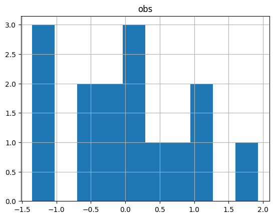

# APSC-5984 Lab 5: Dataframe manipulation

Due: 2023-02-20 (Monday) 23:59:59

## 0. Overview

We will introduce the concept of `DataFrame` in this lab. You will be intstructed to use the Python library `pandas` to manipulate dataframes. First, let's import the library. Conventionally, we import it as `pd`.

```python
import pandas as pd
```

## 1. Data Loading and Saving

We will work on the several files in the `lab_05` folder to practice how to load and save files

### 1.1 CSV and tab-delimited files

#### 1.1.1 Separators

The basic function to load data in `pandas` is `pd.read_csv()`. It can read data from a CSV file or a tab-delimited file. The default delimiter is comma "`,`", but it also allows you to specify other delimiters, such as tab "`\t`".

The file `file_A.csv` is a CSV file with comma as the delimiter:


```python
!cat file_A.csv
```

    id,A,B,C
    a1,1,1,1
    a2,0,1,0
    a3,1,0,1


```python
pd.read_csv('file_A.csv')
```


       id  A  B  C
    0  a1  1  1  1
    1  a2  0  1  0
    2  a3  1  0  1


The file `file_A.csv` was correctly loaded into Python. The dataframe has 3 rows and 4 columns. What if we use the same way to load the file `file_B.txt` that is tab-delimited?


```python
!cat file_B.txt
```

    id	A	B	C
    a1	1	1	1
    a2	0	1	0
    a3	1	0	1


```python
pd.read_csv('file_B.txt')
```


       id\tA\tB\tC
    0  a1\t1\t1\t1
    1  a2\t0\t1\t0
    2  a3\t1\t0\t1


The result was not what we expected. The reason is that the default delimiter is comma, but the file is tab-delimited. We can specify the delimiter as tab "`\t`" to fix the problem.


```python
pd.read_csv('file_B.txt', sep='\t')
```


       id  A  B  C
    0  a1  1  1  1
    1  a2  0  1  0
    2  a3  1  0  1


Great! Noted that `sep` can be any character, such as "`|`", "`;`", "`:`", etc. So, always check the delimiter before loading the file.

#### 1.1.2 Header

In some cases, the first row of the file is not the header. We can use the argument `header` to specify the row number of the header.

This example shows what would happen if we do not specify the header wiht a non-header file `file_A_nh.csv`.


```python
!cat file_A_nh.csv
```

    a1,1,1,1
    a2,0,1,0
    a3,1,0,1


```python
pd.read_csv('file_A_nh.csv')
```


       a1  1  1.1  1.2
    0  a2  0    1    0
    1  a3  1    0    1


The first row was loaded as the header. Here is the fix.


```python
pd.read_csv('file_A_nh.csv', header=None)
```


        0  1  2  3
    0  a1  1  1  1
    1  a2  0  1  0
    2  a3  1  0  1


Some files may be coded with two headers:


```python
!cat file_A_2h.csv
```

    id,A,B,C
    a1,1,1,1
    a2,0,1,0
    a3,1,0,1
    id,D,E,F
    a4,1,1,1
    a5,0,1,0
    a6,1,0,1

If we want the 5th row to be the header, we can use `header=4` (again, it is 0-based).


```python
pd.read_csv('file_A_2h.csv', header=4)
```


       id  D  E  F
    0  a4  1  1  1
    1  a5  0  1  0
    2  a6  1  0  1


### 1.2 Excel spreadsheet (.xlsx)

Excel spreadsheet is a common format for data storage. However, given it is a format that contains multiple sheets, it is not straightforward to load it into a tabular format.

#### 1.2.1 Load a single sheet

Here is an example of using `pd.read_excel()` to load the spreadsheet `file_C.xlsx`:


```python
pd.read_excel('file_C.xlsx')
```


       id  A  B  C
    0  a1  1  1  1
    1  a2  0  1  0
    2  a3  1  0  1


By default, it only loads the first sheet. We can specify the sheet name or the sheet number to load other sheets.


```python
pd.read_excel('file_C.xlsx', sheet_name='Sheet2')
```


       id  D  E  F
    0  a4  0  1  0
    1  a5  0  0  0
    2  a6  1  1  0
    3  a7  2  2  0
    4  a8  3  3  0
    5  a9  4  4  0


```python
pd.read_excel('file_C.xlsx', sheet_name='Sheet3')
```


              A         B
    0  0.631007  0.034287
    1  0.114071  0.370723
    2  0.156949  0.851093
    3  0.051913  0.089328
    4  0.089216  0.861941
    5  0.572473  0.364972
    6  0.452546  0.152391
    7  0.052752  0.024641


### 1.2.2 Dictionary of dataframes

In `pandas`, Excel spreadsheet is loaded as a dictionary of dataframes. The keys are the sheet names, and the values are the dataframes.

To load the entire spreadsheet taht contains all sheets, we can use `pd.read_excel()` with `sheet_name=None`:


```python
data = pd.read_excel('file_C.xlsx', sheet_name=None)
print(data)
```

    {'Sheet1':    id  A  B  C
    0  a1  1  1  1
    1  a2  0  1  0
    2  a3  1  0  1, 'Sheet2':    id  D  E  F
    0  a4  0  1  0
    1  a5  0  0  0
    2  a6  1  1  0
    3  a7  2  2  0
    4  a8  3  3  0
    5  a9  4  4  0, 'Sheet3':           A         B
    0  0.631007  0.034287
    1  0.114071  0.370723
    2  0.156949  0.851093
    3  0.051913  0.089328
    4  0.089216  0.861941
    5  0.572473  0.364972
    6  0.452546  0.152391
    7  0.052752  0.024641}


The sheets might not be displayed well aligned, but you can still see the keys as each sheet name and its corresponding dataframe. You can use the 'lookup' function we learned in the previous lecture to find the dataframe of a specific sheet:


```python
data["Sheet3"]
```


              A         B
    0  0.631007  0.034287
    1  0.114071  0.370723
    2  0.156949  0.851093
    3  0.051913  0.089328
    4  0.089216  0.861941
    5  0.572473  0.364972
    6  0.452546  0.152391
    7  0.052752  0.024641


### 1.3 Save data

#### 1.3.1 Save as CSV

We can use `df.to_csv()` to save a dataframe as a CSV file. Here are parameters that we can use:

- `sep`: the delimiter. Default is comma "`,`".
- `index`: whether to save the index column. Default is `True`.
- `header`: whether to save the header. Default is `True`.
- `columns`: the columns to save. Default is `None` (all columns).
- `mode`: the mode to open the file. Default is `"w"` (write). Other options are `"a"` (append) and `"r"` (read).


```python
data["Sheet1"].to_csv('out_A.csv')
!cat out_A.csv
```

    ,id,A,B,C
    0,a1,1,1,1
    1,a2,0,1,0
    2,a3,1,0,1


```python
data["Sheet1"].to_csv('out_A.csv', index=False)
!cat out_A.csv
```

    id,A,B,C
    a1,1,1,1
    a2,0,1,0
    a3,1,0,1


```python
data["Sheet1"].to_csv('out_A.csv', index=False, header=None)
!cat out_A.csv
```

    a1,1,1,1
    a2,0,1,0
    a3,1,0,1


```python
data["Sheet1"].to_csv('out_A.csv', index=False, header=None, sep='\t')
!cat out_A.csv
```

    a1	1	1	1
    a2	0	1	0
    a3	1	0	1


```python
data["Sheet1"].to_csv('out_A.csv', index=False, columns=['A', 'B'])
!cat out_A.csv
```

    A,B
    1,1
    0,1
    1,0


### 1.3.2 Save as Excel spreadsheet

Pandas also allows us to save a dataframe as an Excel spreadsheet. It is highly recommended to interact with Excel spreadsheet using `with` statement when you want to work with multiple sheets. Here is an example:


```python
with pd.ExcelWriter('out_C2.xlsx') as writer:
    data["Sheet1"].to_excel(writer, sheet_name='Sheet1')
    data["Sheet2"].to_excel(writer, sheet_name='Sheet2')
    data["Sheet3"].to_excel(writer, sheet_name='Sheet3')
```

An example to append a new sheet to an existing spreadsheet:


```python
with pd.ExcelWriter('out_C2.xlsx', mode="a") as writer:
    data["Sheet1"].to_excel(writer, sheet_name='Sheet4', index=False)
    data["Sheet2"].to_excel(writer, sheet_name='Sheet5', index=False)
    data["Sheet3"].to_excel(writer, sheet_name='Sheet6', index=False)
```

## 2. Construct a dataframe

We can also construct a dataframe from scratch. We can start with a dictionary of lists to define our dataframe:


```python
data = dict()
data["id"] = ["id1", "id2", "id3", "id4"]
data["factor"] = ["A", "B", "A", "B"]
data["value"] = [1, 2, 3, 4]
print(data)
```

    {'id': ['id1', 'id2', 'id3', 'id4'], 'factor': ['A', 'B', 'A', 'B'], 'value': [1, 2, 3, 4]}


And we can put the dictionary into a dataframe using `pd.DataFrame()`:


```python
df = pd.DataFrame(data)
df
```


        id factor  value
    0  id1      A      1
    1  id2      B      2
    2  id3      A      3
    3  id4      B      4


## 3. Dataframe manipulation

### 3.1 Index location (.iloc)

We can use `.iloc()` method to access the data by numeric index location. The indexing rule is the same as what we have learned in the sections of `list` and `numpy`. In `.iloc()`, the first argument is the row index, and the second argument is the column index.

Here is an example dataframe:


```python
data = pd.read_excel('file_C.xlsx', sheet_name="Sheet1")
data
```


       id  A  B  C
    0  a1  1  1  1
    1  a2  0  1  0
    2  a3  1  0  1


Get the second and third row:


```python
data.iloc[[1, 2], :]
```


       id  A  B  C
    1  a2  0  1  0
    2  a3  1  0  1


Get multiple (first and second) columns. (Note we use `:` to specify all rows.)


```python
data.iloc[:, [0, 1]]
```


       id  A
    0  a1  1
    1  a2  0
    2  a3  1


It is equivalent to using slicing:


```python
data.iloc[:, :2]
```


       id  A
    0  a1  1
    1  a2  0
    2  a3  1


### 3.2 Label-based indexing (.loc)

The `.loc()` method is another way to access the data. It works with either column/index names or boolean arrays.


```python
data.loc[[0, 1], :]
```


       id  A  B  C
    0  a1  1  1  1
    1  a2  0  1  0


```python
data.loc[:, ['id', 'B']]
```


       id  B
    0  a1  1
    1  a2  1
    2  a3  0


Use boolean to select column containing a letter "B". (We can use `df.columns` to list all column names)


```python
colnames = data.columns
bol_B = ["B" in col for col in colnames]
print(bol_B)
```

    [False, False, True, False]


```python
data.loc[:, bol_B]
```


       B
    0  1
    1  1
    2  0


```python
data
```


       id  A  B  C
    0  a1  1  1  1
    1  a2  0  1  0
    2  a3  1  0  1


### 3.3 Create a new column
The `.loc()` method is also a recommended way (compared to `df["new_column"]`) to create a new column. Simply put a desired column name in the second argument, and assign a value to it.


```python
data.loc[:, "new_col"] = ["new"] * 3
# or
data.loc[:, "new_col"] = "new"
data
```


       id  A  B  C new_col
    0  a1  1  1  1     new
    1  a2  0  1  0     new
    2  a3  1  0  1     new


### 3.4 Miscellaneous

#### 3.4.1 Drop a column


```python
data.drop(columns=["B"])
```


       id  A  C new_col
    0  a1  1  1     new
    1  a2  0  0     new
    2  a3  1  1     new


### 3.4.2 Drop a row


```python
data.drop(index=[0, 1])
```


       id  A  B  C new_col
    2  a3  1  0  1     new


### 3.4.3 inspect the dimension and summary

`df.shape` returns the dimension of the dataframe. This tells us that the dataframe has 3 rows and 5 columns.


```python
data.shape
```


    (3, 5)


df.info() is another way to inspect the dataframe of its dimension and data types of each column.


```python
data.info()
```

    <class 'pandas.core.frame.DataFrame'>
    RangeIndex: 3 entries, 0 to 2
    Data columns (total 5 columns):
     #   Column   Non-Null Count  Dtype 
    ---  ------   --------------  ----- 
     0   id       3 non-null      object
     1   A        3 non-null      int64 
     2   B        3 non-null      int64 
     3   C        3 non-null      int64 
     4   new_col  3 non-null      object
    dtypes: int64(3), object(2)
    memory usage: 248.0+ bytes


`df.describe()` returns the summary statistics of the dataframe. Only numeric columns are included in the summary statistics.


```python
data.describe()
```


                  A         B         C
    count  3.000000  3.000000  3.000000
    mean   0.666667  0.666667  0.666667
    std    0.577350  0.577350  0.577350
    min    0.000000  0.000000  0.000000
    25%    0.500000  0.500000  0.500000
    50%    1.000000  1.000000  1.000000
    75%    1.000000  1.000000  1.000000
    max    1.000000  1.000000  1.000000


`df["column"].value_counts()` returns the counts of unique values in that specified column. Below the example tells us that there are two rows with value 1 and one row with value 0.


```python
data["B"].value_counts()
```


    1    2
    0    1
    Name: B, dtype: int64


## 4.Querying with an example dataframe

Let's create a mock dataframe for this section:


```python
import numpy as np
import pandas as pd

factors = [i for _ in range(30) for i in ["A", "B", "C", "D"]]
# random sample from id {1, 2, 3, 4, 5, 6}
ids = np.random.choice(["id_%d" % (i + 1) for i in range(6)], 120)
envs = [i for _ in range(60) for i in ["env_1", "env_2"]]
obs = np.random.normal(0, 1, 120)
data = pd.DataFrame({"factor": factors, "id": ids, "env": envs, "obs": obs})
data.to_csv("file_D.csv", index=False)
```


```python
data = pd.read_csv("file_D.csv")
data.info()
data
```

    <class 'pandas.core.frame.DataFrame'>
    RangeIndex: 120 entries, 0 to 119
    Data columns (total 4 columns):
     #   Column  Non-Null Count  Dtype  
    ---  ------  --------------  -----  
     0   factor  120 non-null    object 
     1   id      120 non-null    object 
     2   env     120 non-null    object 
     3   obs     120 non-null    float64
    dtypes: float64(1), object(3)
    memory usage: 3.9+ KB


        factor    id    env       obs
    0        A  id_4  env_1 -0.103541
    1        B  id_5  env_2 -0.743779
    2        C  id_3  env_1  1.367427
    3        D  id_1  env_2  1.277709
    4        A  id_5  env_1 -0.036865
    ..     ...   ...    ...       ...
    115      D  id_2  env_2  1.090125
    116      A  id_3  env_1  1.992980
    117      B  id_2  env_2 -1.098938
    118      C  id_5  env_1  0.973049
    119      D  id_3  env_2 -0.049207
    
    [120 rows x 4 columns]


### 4.1 Check the distribution of each column


```python
data["factor"].value_counts()
```


    A    30
    B    30
    C    30
    D    30
    Name: factor, dtype: int64


```python
data["id"].value_counts()
```


    id_3    26
    id_5    21
    id_2    20
    id_6    20
    id_4    17
    id_1    16
    Name: id, dtype: int64


```python
data["env"].value_counts()
```


    env_1    60
    env_2    60
    Name: env, dtype: int64


```python
data["obs"].value_counts()
```


    -0.103541    1
    -0.743779    1
    -0.420372    1
    -0.974859    1
     0.847130    1
                ..
    -0.801611    1
     0.609561    1
    -0.305139    1
     0.960369    1
    -0.049207    1
    Name: obs, Length: 120, dtype: int64


```python
data["obs"].describe()
```


    count    120.000000
    mean      -0.007360
    std        0.996616
    min       -3.128698
    25%       -0.673746
    50%       -0.078736
    75%        0.718717
    max        2.401238
    Name: obs, dtype: float64


For better visualization, we can use `df.hist()` to plot the histogram of each column.


```python
data["obs"].hist()
```


    <AxesSubplot: >


    

    


### 4.2 Subset the dataframe (query)


```python
data_sub = data.query("obs > 0")
data_sub[:5]
```


       factor    id    env       obs
    2       C  id_3  env_1  1.367427
    3       D  id_1  env_2  1.277709
    5       B  id_4  env_2  0.018896
    6       C  id_3  env_1  0.697119
    10      C  id_2  env_1  0.129155


```python
data_sub["obs"].hist()
```


    <AxesSubplot: >


    

    


```python
data_id1 = data.query("id == 'id_1'")
data_id1[:5]
```


       factor    id    env       obs
    3       D  id_1  env_2  1.277709
    12      A  id_1  env_1 -0.514876
    15      D  id_1  env_2 -0.910731
    18      C  id_1  env_1  0.324932
    23      D  id_1  env_2 -0.915508


```python
data_id1.hist()
```


    array([[<AxesSubplot: title={'center': 'obs'}>]], dtype=object)


    

    


Multiple conditions can be combined using `&` (and) and `|` (or).


```python
data.query("id == 'id_1' and (obs > 1 or obs < -1)")
```


        factor    id    env       obs
    3        D  id_1  env_2  1.277709
    30       C  id_1  env_1  1.959333
    50       C  id_1  env_1 -1.807202
    53       B  id_1  env_2  1.226145
    95       D  id_1  env_2 -2.187798
    102      C  id_1  env_1 -3.128698
    113      B  id_1  env_2  1.556891


### 4.3 Grouping


```python
data.groupby("id")["obs"].mean()
```


    id
    id_1   -0.353290
    id_2    0.010237
    id_3    0.338903
    id_4    0.089247
    id_5   -0.069404
    id_6   -0.215322
    Name: obs, dtype: float64


```python
data.groupby(["id", "factor"])["obs"].mean()
```


    id    factor
    id_1  A        -0.572145
          B         0.800764
          C        -0.662909
          D        -0.622944
    id_2  A        -0.035847
          B        -0.379162
          C        -0.028974
          D         0.710803
    id_3  A         0.537934
          B         0.016166
          C         0.474403
          D         0.337999
    id_4  A         0.344797
          B        -0.510488
          D         0.190927
    id_5  A        -0.078994
          B        -0.326861
          C         0.162713
          D         0.018248
    id_6  A        -0.401546
          B         0.269396
          C        -0.271808
          D        -0.718168
    Name: obs, dtype: float64


```python
# multiple calculation
cus_fun = lambda x: x.max() - x.min()
pivot = data.groupby(["id", "factor"])["obs"].agg(["mean", "std", "count", cus_fun])
pivot
```


                     mean       std  count  <lambda_0>
    id   factor                                       
    id_1 A      -0.572145  0.275969      4    0.600521
         B       0.800764  1.036493      3    1.937635
         C      -0.662909  2.253997      4    5.088031
         D      -0.622944  1.253941      5    3.465507
    id_2 A      -0.035847  0.835036      5    2.113688
         B      -0.379162  0.991673      4    2.105734
         C      -0.028974  1.273576      8    3.951148
         D       0.710803  0.338261      3    0.649650
    id_3 A       0.537934  1.056636      5    2.838498
         B       0.016166  1.082023      6    2.891030
         C       0.474403  0.646405      7    1.984283
         D       0.337999  1.121005      8    3.527217
    id_4 A       0.344797  0.761420      7    2.389062
         B      -0.510488  0.353390      4    0.731529
         D       0.190927  1.028478      6    2.801286
    id_5 A      -0.078994  0.091463      3    0.167741
         B      -0.326861  0.728683      7    2.330027
         C       0.162713  0.888686      6    2.129052
         D       0.018248  0.861026      5    2.056391
    id_6 A      -0.401546  1.009011      6    2.810509
         B       0.269396  0.824500      6    2.113502
         C      -0.271808  1.400287      5    3.316543
         D      -0.718168  0.471266      3    0.931386


```python
pivot.loc["id_5"]
```


                mean       std  count  <lambda_0>
    factor                                       
    A      -0.078994  0.091463      3    0.167741
    B      -0.326861  0.728683      7    2.330027
    C       0.162713  0.888686      6    2.129052
    D       0.018248  0.861026      5    2.056391


```python
pivot.loc["id_3"].loc["A"]
```


    mean          0.537934
    std           1.056636
    count         5.000000
    <lambda_0>    2.838498
    Name: A, dtype: float64


```python
data_pivot = pivot.reset_index()
data_pivot
```


          id factor      mean       std  count  <lambda_0>
    0   id_1      A -0.572145  0.275969      4    0.600521
    1   id_1      B  0.800764  1.036493      3    1.937635
    2   id_1      C -0.662909  2.253997      4    5.088031
    3   id_1      D -0.622944  1.253941      5    3.465507
    4   id_2      A -0.035847  0.835036      5    2.113688
    5   id_2      B -0.379162  0.991673      4    2.105734
    6   id_2      C -0.028974  1.273576      8    3.951148
    7   id_2      D  0.710803  0.338261      3    0.649650
    8   id_3      A  0.537934  1.056636      5    2.838498
    9   id_3      B  0.016166  1.082023      6    2.891030
    10  id_3      C  0.474403  0.646405      7    1.984283
    11  id_3      D  0.337999  1.121005      8    3.527217
    12  id_4      A  0.344797  0.761420      7    2.389062
    13  id_4      B -0.510488  0.353390      4    0.731529
    14  id_4      D  0.190927  1.028478      6    2.801286
    15  id_5      A -0.078994  0.091463      3    0.167741
    16  id_5      B -0.326861  0.728683      7    2.330027
    17  id_5      C  0.162713  0.888686      6    2.129052
    18  id_5      D  0.018248  0.861026      5    2.056391
    19  id_6      A -0.401546  1.009011      6    2.810509
    20  id_6      B  0.269396  0.824500      6    2.113502
    21  id_6      C -0.271808  1.400287      5    3.316543
    22  id_6      D -0.718168  0.471266      3    0.931386


```python
data_pivot.to_csv("out_pivot.csv", index=False)
```


```python
!cat out_pivot.csv
```

    id,factor,mean,std,count,<lambda_0>
    id_1,A,-0.5721451319957364,0.2759691621869315,4,0.6005207714131151
    id_1,B,0.8007641707797974,1.0364934807700155,3,1.9376345238846369
    id_1,C,-0.6629089104632997,2.253996983629481,4,5.088031295812392
    id_1,D,-0.6229444416720034,1.2539408642924903,5,3.465507221194403
    id_2,A,-0.035846506594991834,0.8350360108995132,5,2.113687559524173
    id_2,B,-0.379161981588368,0.9916730486129572,4,2.105734163902122
    id_2,C,-0.028973912570866345,1.2735759529812984,8,3.9511482250204737
    id_2,D,0.7108034172724883,0.33826146647224276,3,0.6496501604168332
    id_3,A,0.5379337768185726,1.0566362183461382,5,2.838498093174227
    id_3,B,0.016166265985501038,1.0820228345659655,6,2.8910301815434467
    id_3,C,0.474403439830994,0.646404644751632,7,1.9842826893508816
    id_3,D,0.3379989349365774,1.1210052264622168,8,3.5272166799089844
    id_4,A,0.3447970839358367,0.7614202452739026,7,2.389062256967856
    id_4,B,-0.5104878699033722,0.35339019404120087,4,0.7315285533460211
    id_4,D,0.19092723591472208,1.0284776900867785,6,2.8012856309176444
    id_5,A,-0.07899438127161257,0.09146273308524398,3,0.167740923053321
    id_5,B,-0.32686142994641176,0.728683117065449,7,2.3300269181696964
    id_5,C,0.16271334666682133,0.8886856920836689,6,2.1290522592475236
    id_5,D,0.018248250423816382,0.8610262343729462,5,2.056390978154677
    id_6,A,-0.40154626931806864,1.00901117222255,6,2.810509048350021
    id_6,B,0.2693955898375124,0.8244996811829504,6,2.113501718226548
    id_6,C,-0.27180772132303965,1.4002872099962633,5,3.3165427766752997
    id_6,D,-0.7181675436798494,0.4712663301452729,3,0.9313858318138433

