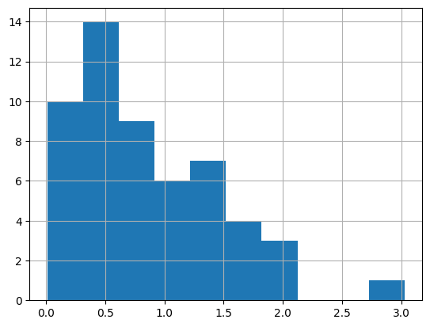

# APSC-5984 Lab 5: Dataframe manipulation

Due: 2023-02-20 (Monday) 23:59:59

- [APSC-5984 Lab 5: Dataframe manipulation](#apsc-5984-lab-5-dataframe-manipulation)
  - [0. Overview](#0-overview)
  - [1. Data Loading and Saving](#1-data-loading-and-saving)
    - [1.1 CSV and tab-delimited files](#11-csv-and-tab-delimited-files)
      - [1.1.1 Separators](#111-separators)
      - [1.1.2 Header](#112-header)
    - [1.2 Excel spreadsheet (.xlsx)](#12-excel-spreadsheet-xlsx)
      - [1.2.1 Load a single sheet](#121-load-a-single-sheet)
    - [1.2.2 Dictionary of dataframes](#122-dictionary-of-dataframes)
    - [1.3 Save data](#13-save-data)
      - [1.3.1 Save as CSV](#131-save-as-csv)
    - [1.3.2 Save as Excel spreadsheet](#132-save-as-excel-spreadsheet)
  - [2. Construct a dataframe](#2-construct-a-dataframe)
  - [3. Dataframe manipulation](#3-dataframe-manipulation)
    - [3.1 Index location (.iloc)](#31-index-location-iloc)
    - [3.2 Label-based indexing (.loc)](#32-label-based-indexing-loc)
    - [3.3 Create a new column](#33-create-a-new-column)
    - [3.4 Miscellaneous](#34-miscellaneous)
      - [3.4.1 Drop a column](#341-drop-a-column)
    - [3.4.2 Drop a row](#342-drop-a-row)
    - [3.4.3 inspect the dimension and summary](#343-inspect-the-dimension-and-summary)
  - [4.Querying with an example dataframe](#4querying-with-an-example-dataframe)
    - [4.1 Check the distribution of each column](#41-check-the-distribution-of-each-column)
    - [4.2 Subset the dataframe (query)](#42-subset-the-dataframe-query)
    - [4.3 Grouping](#43-grouping)


## 0. Overview

We will introduce the concept of `DataFrame` in this lab. You will be intstructed to use the Python library `pandas` to manipulate dataframes. First, let's import the library. Conventionally, we import it as `pd`.


```python
import pandas as pd
```

## 1. Data Loading and Saving

We will work on the several files in the `lab_05` folder to practice how to load and save files

### 1.1 CSV and tab-delimited files

#### 1.1.1 Separators

The basic function to load data in `pandas` is `pd.read_csv()`. It can read data from a CSV file or a tab-delimited file. The default delimiter is comma "`,`", but it also allows you to specify other delimiters, such as tab "`\t`".

The file `file_A.csv` is a CSV file with comma as the delimiter:


```python
!cat file_A.csv
```

    id,A,B,C
    a1,1,1,1
    a2,0,1,0
    a3,1,0,1


```python
pd.read_csv('file_A.csv')
```

       id  A  B  C
    0  a1  1  1  1
    1  a2  0  1  0
    2  a3  1  0  1


The file `file_A.csv` was correctly loaded into Python. The dataframe has 3 rows and 4 columns. What if we use the same way to load the file `file_B.txt` that is tab-delimited?


```python
!cat file_B.txt
```

    id	A	B	C
    a1	1	1	1
    a2	0	1	0
    a3	1	0	1


```python
pd.read_csv('file_B.txt')
```

             id\tA\tB\tC
    0        a1\t1\t1\t1
    1        a2\t0\t1\t0
    2  a3\t1\t0\t1\t\t\t


The result was not what we expected. The reason is that the default delimiter is comma, but the file is tab-delimited. We can specify the delimiter as tab "`\t`" to fix the problem.


```python
pd.read_csv('file_B.txt', sep='\t')
```

       id  A  B  C
    0  a1  1  1  1
    1  a2  0  1  0
    2  a3  1  0  1


Great! Noted that `sep` can be any character, such as "`|`", "`;`", "`:`", etc. So, always check the delimiter before loading the file.

#### 1.1.2 Header

In some cases, the first row of the file is not the header. We can use the argument `header` to specify the row number of the header.

This example shows what would happen if we do not specify the header wiht a non-header file `file_A_nh.csv`.


```python
!cat file_A_nh.csv
```

    a1,1,1,1
    a2,0,1,0
    a3,1,0,1


```python
pd.read_csv('file_A_nh.csv')
```


<div>
<style scoped>
    .dataframe tbody tr th:only-of-type {
        vertical-align: middle;
    }

    .dataframe tbody tr th {
        vertical-align: top;
    }

    .dataframe thead th {
        text-align: right;
    }
</style>
<table border="1" class="dataframe">
  <thead>
    <tr style="text-align: right;">
      <th></th>
      <th>a1</th>
      <th>1</th>
      <th>1.1</th>
      <th>1.2</th>
    </tr>
  </thead>
  <tbody>
    <tr>
      <th>0</th>
      <td>a2</td>
      <td>0</td>
      <td>1</td>
      <td>0</td>
    </tr>
    <tr>
      <th>1</th>
      <td>a3</td>
      <td>1</td>
      <td>0</td>
      <td>1</td>
    </tr>
  </tbody>
</table>
</div>


The first row was loaded as the header. Here is the fix.


```python
pd.read_csv('file_A_nh.csv', header=None)
```


<div>
<style scoped>
    .dataframe tbody tr th:only-of-type {
        vertical-align: middle;
    }

    .dataframe tbody tr th {
        vertical-align: top;
    }

    .dataframe thead th {
        text-align: right;
    }
</style>
<table border="1" class="dataframe">
  <thead>
    <tr style="text-align: right;">
      <th></th>
      <th>0</th>
      <th>1</th>
      <th>2</th>
      <th>3</th>
    </tr>
  </thead>
  <tbody>
    <tr>
      <th>0</th>
      <td>a1</td>
      <td>1</td>
      <td>1</td>
      <td>1</td>
    </tr>
    <tr>
      <th>1</th>
      <td>a2</td>
      <td>0</td>
      <td>1</td>
      <td>0</td>
    </tr>
    <tr>
      <th>2</th>
      <td>a3</td>
      <td>1</td>
      <td>0</td>
      <td>1</td>
    </tr>
  </tbody>
</table>
</div>


Some files may be coded with two headers:


```python
!cat file_A_2h.csv
```

    id,A,B,C
    a1,1,1,1
    a2,0,1,0
    a3,1,0,1
    id,D,E,F
    a4,1,1,1
    a5,0,1,0
    a6,1,0,1

If we want the 5th row to be the header, we can use `header=4` (again, it is 0-based).


```python
pd.read_csv('file_A_2h.csv', header=4)
```


<div>
<style scoped>
    .dataframe tbody tr th:only-of-type {
        vertical-align: middle;
    }

    .dataframe tbody tr th {
        vertical-align: top;
    }

    .dataframe thead th {
        text-align: right;
    }
</style>
<table border="1" class="dataframe">
  <thead>
    <tr style="text-align: right;">
      <th></th>
      <th>id</th>
      <th>D</th>
      <th>E</th>
      <th>F</th>
    </tr>
  </thead>
  <tbody>
    <tr>
      <th>0</th>
      <td>a4</td>
      <td>1</td>
      <td>1</td>
      <td>1</td>
    </tr>
    <tr>
      <th>1</th>
      <td>a5</td>
      <td>0</td>
      <td>1</td>
      <td>0</td>
    </tr>
    <tr>
      <th>2</th>
      <td>a6</td>
      <td>1</td>
      <td>0</td>
      <td>1</td>
    </tr>
  </tbody>
</table>
</div>


### 1.2 Excel spreadsheet (.xlsx)

Excel spreadsheet is a common format for data storage. However, given it is a format that contains multiple sheets, it is not straightforward to load it into a tabular format.

#### 1.2.1 Load a single sheet

Here is an example of using `pd.read_excel()` to load the spreadsheet `file_C.xlsx`:


```python
pd.read_excel('file_C.xlsx')
```


<div>
<style scoped>
    .dataframe tbody tr th:only-of-type {
        vertical-align: middle;
    }

    .dataframe tbody tr th {
        vertical-align: top;
    }

    .dataframe thead th {
        text-align: right;
    }
</style>
<table border="1" class="dataframe">
  <thead>
    <tr style="text-align: right;">
      <th></th>
      <th>id</th>
      <th>A</th>
      <th>B</th>
      <th>C</th>
    </tr>
  </thead>
  <tbody>
    <tr>
      <th>0</th>
      <td>a1</td>
      <td>1</td>
      <td>1</td>
      <td>1</td>
    </tr>
    <tr>
      <th>1</th>
      <td>a2</td>
      <td>0</td>
      <td>1</td>
      <td>0</td>
    </tr>
    <tr>
      <th>2</th>
      <td>a3</td>
      <td>1</td>
      <td>0</td>
      <td>1</td>
    </tr>
  </tbody>
</table>
</div>


By default, it only loads the first sheet. We can specify the sheet name or the sheet number to load other sheets.


```python
pd.read_excel('file_C.xlsx', sheet_name='Sheet2')
```


<div>
<style scoped>
    .dataframe tbody tr th:only-of-type {
        vertical-align: middle;
    }

    .dataframe tbody tr th {
        vertical-align: top;
    }

    .dataframe thead th {
        text-align: right;
    }
</style>
<table border="1" class="dataframe">
  <thead>
    <tr style="text-align: right;">
      <th></th>
      <th>id</th>
      <th>D</th>
      <th>E</th>
      <th>F</th>
    </tr>
  </thead>
  <tbody>
    <tr>
      <th>0</th>
      <td>a4</td>
      <td>0</td>
      <td>1</td>
      <td>0</td>
    </tr>
    <tr>
      <th>1</th>
      <td>a5</td>
      <td>0</td>
      <td>0</td>
      <td>0</td>
    </tr>
    <tr>
      <th>2</th>
      <td>a6</td>
      <td>1</td>
      <td>1</td>
      <td>0</td>
    </tr>
    <tr>
      <th>3</th>
      <td>a7</td>
      <td>2</td>
      <td>2</td>
      <td>0</td>
    </tr>
    <tr>
      <th>4</th>
      <td>a8</td>
      <td>3</td>
      <td>3</td>
      <td>0</td>
    </tr>
    <tr>
      <th>5</th>
      <td>a9</td>
      <td>4</td>
      <td>4</td>
      <td>0</td>
    </tr>
  </tbody>
</table>
</div>


```python
pd.read_excel('file_C.xlsx', sheet_name='Sheet3')
```


<div>
<style scoped>
    .dataframe tbody tr th:only-of-type {
        vertical-align: middle;
    }

    .dataframe tbody tr th {
        vertical-align: top;
    }

    .dataframe thead th {
        text-align: right;
    }
</style>
<table border="1" class="dataframe">
  <thead>
    <tr style="text-align: right;">
      <th></th>
      <th>A</th>
      <th>B</th>
    </tr>
  </thead>
  <tbody>
    <tr>
      <th>0</th>
      <td>0.631007</td>
      <td>0.034287</td>
    </tr>
    <tr>
      <th>1</th>
      <td>0.114071</td>
      <td>0.370723</td>
    </tr>
    <tr>
      <th>2</th>
      <td>0.156949</td>
      <td>0.851093</td>
    </tr>
    <tr>
      <th>3</th>
      <td>0.051913</td>
      <td>0.089328</td>
    </tr>
    <tr>
      <th>4</th>
      <td>0.089216</td>
      <td>0.861941</td>
    </tr>
    <tr>
      <th>5</th>
      <td>0.572473</td>
      <td>0.364972</td>
    </tr>
    <tr>
      <th>6</th>
      <td>0.452546</td>
      <td>0.152391</td>
    </tr>
    <tr>
      <th>7</th>
      <td>0.052752</td>
      <td>0.024641</td>
    </tr>
  </tbody>
</table>
</div>


### 1.2.2 Dictionary of dataframes

In `pandas`, Excel spreadsheet is loaded as a dictionary of dataframes. The keys are the sheet names, and the values are the dataframes.

To load the entire spreadsheet taht contains all sheets, we can use `pd.read_excel()` with `sheet_name=None`:


```python
data = pd.read_excel('file_C.xlsx', sheet_name=None)
print(data)
```

    {'Sheet1':    id  A  B  C
    0  a1  1  1  1
    1  a2  0  1  0
    2  a3  1  0  1, 'Sheet2':    id  D  E  F
    0  a4  0  1  0
    1  a5  0  0  0
    2  a6  1  1  0
    3  a7  2  2  0
    4  a8  3  3  0
    5  a9  4  4  0, 'Sheet3':           A         B
    0  0.631007  0.034287
    1  0.114071  0.370723
    2  0.156949  0.851093
    3  0.051913  0.089328
    4  0.089216  0.861941
    5  0.572473  0.364972
    6  0.452546  0.152391
    7  0.052752  0.024641}


The sheets might not be displayed well aligned, but you can still see the keys as each sheet name and its corresponding dataframe. You can use the 'lookup' function we learned in the previous lecture to find the dataframe of a specific sheet:


```python
data["Sheet3"]
```


<div>
<style scoped>
    .dataframe tbody tr th:only-of-type {
        vertical-align: middle;
    }

    .dataframe tbody tr th {
        vertical-align: top;
    }

    .dataframe thead th {
        text-align: right;
    }
</style>
<table border="1" class="dataframe">
  <thead>
    <tr style="text-align: right;">
      <th></th>
      <th>A</th>
      <th>B</th>
    </tr>
  </thead>
  <tbody>
    <tr>
      <th>0</th>
      <td>0.631007</td>
      <td>0.034287</td>
    </tr>
    <tr>
      <th>1</th>
      <td>0.114071</td>
      <td>0.370723</td>
    </tr>
    <tr>
      <th>2</th>
      <td>0.156949</td>
      <td>0.851093</td>
    </tr>
    <tr>
      <th>3</th>
      <td>0.051913</td>
      <td>0.089328</td>
    </tr>
    <tr>
      <th>4</th>
      <td>0.089216</td>
      <td>0.861941</td>
    </tr>
    <tr>
      <th>5</th>
      <td>0.572473</td>
      <td>0.364972</td>
    </tr>
    <tr>
      <th>6</th>
      <td>0.452546</td>
      <td>0.152391</td>
    </tr>
    <tr>
      <th>7</th>
      <td>0.052752</td>
      <td>0.024641</td>
    </tr>
  </tbody>
</table>
</div>


### 1.3 Save data

#### 1.3.1 Save as CSV

We can use `df.to_csv()` to save a dataframe as a CSV file. Here are parameters that we can use:

- `sep`: the delimiter. Default is comma "`,`".
- `index`: whether to save the index column. Default is `True`.
- `header`: whether to save the header. Default is `True`.
- `columns`: the columns to save. Default is `None` (all columns).
- `mode`: the mode to open the file. Default is `"w"` (write). Other options are `"a"` (append) and `"r"` (read).


```python
data["Sheet1"].to_csv('out_A.csv')
!cat out_A.csv
```

    ,id,A,B,C
    0,a1,1,1,1
    1,a2,0,1,0
    2,a3,1,0,1


```python
data["Sheet1"].to_csv('out_A.csv', index=False)
!cat out_A.csv
```

    id,A,B,C
    a1,1,1,1
    a2,0,1,0
    a3,1,0,1


```python
data["Sheet1"].to_csv('out_A.csv', index=False, header=None)
!cat out_A.csv
```

    a1,1,1,1
    a2,0,1,0
    a3,1,0,1


```python
data["Sheet1"].to_csv('out_A.csv', index=False, header=None, sep='\t')
!cat out_A.csv
```

    a1	1	1	1
    a2	0	1	0
    a3	1	0	1


```python
data["Sheet1"].to_csv('out_A.csv', index=False, columns=['A', 'B'])
!cat out_A.csv
```

    A,B
    1,1
    0,1
    1,0


### 1.3.2 Save as Excel spreadsheet

Pandas also allows us to save a dataframe as an Excel spreadsheet. It is highly recommended to interact with Excel spreadsheet using `with` statement when you want to work with multiple sheets. Here is an example:


```python
with pd.ExcelWriter('out_C2.xlsx') as writer:
    data["Sheet1"].to_excel(writer, sheet_name='Sheet1')
    data["Sheet2"].to_excel(writer, sheet_name='Sheet2')
    data["Sheet3"].to_excel(writer, sheet_name='Sheet3')
```

An example to append a new sheet to an existing spreadsheet:


```python
with pd.ExcelWriter('out_C2.xlsx', mode="a") as writer:
    data["Sheet1"].to_excel(writer, sheet_name='Sheet4', index=False)
    data["Sheet2"].to_excel(writer, sheet_name='Sheet5', index=False)
    data["Sheet3"].to_excel(writer, sheet_name='Sheet6', index=False)
```

## 2. Construct a dataframe

We can also construct a dataframe from scratch. We can start with a dictionary of lists to define our dataframe:


```python
data = dict()
data["id"] = ["id1", "id2", "id3", "id4"]
data["factor"] = ["A", "B", "A", "B"]
data["value"] = [1, 2, 3, 4]
print(data)
```

    {'id': ['id1', 'id2', 'id3', 'id4'], 'factor': ['A', 'B', 'A', 'B'], 'value': [1, 2, 3, 4]}


And we can put the dictionary into a dataframe using `pd.DataFrame()`:


```python
df = pd.DataFrame(data)
df
```


<div>
<style scoped>
    .dataframe tbody tr th:only-of-type {
        vertical-align: middle;
    }

    .dataframe tbody tr th {
        vertical-align: top;
    }

    .dataframe thead th {
        text-align: right;
    }
</style>
<table border="1" class="dataframe">
  <thead>
    <tr style="text-align: right;">
      <th></th>
      <th>id</th>
      <th>factor</th>
      <th>value</th>
    </tr>
  </thead>
  <tbody>
    <tr>
      <th>0</th>
      <td>id1</td>
      <td>A</td>
      <td>1</td>
    </tr>
    <tr>
      <th>1</th>
      <td>id2</td>
      <td>B</td>
      <td>2</td>
    </tr>
    <tr>
      <th>2</th>
      <td>id3</td>
      <td>A</td>
      <td>3</td>
    </tr>
    <tr>
      <th>3</th>
      <td>id4</td>
      <td>B</td>
      <td>4</td>
    </tr>
  </tbody>
</table>
</div>


## 3. Dataframe manipulation

### 3.1 Index location (.iloc)

We can use `.iloc()` method to access the data by numeric index location. The indexing rule is the same as what we have learned in the sections of `list` and `numpy`. In `.iloc()`, the first argument is the row index, and the second argument is the column index.

Here is an example dataframe:


```python
data = pd.read_excel('file_C.xlsx', sheet_name="Sheet1")
data
```


<div>
<style scoped>
    .dataframe tbody tr th:only-of-type {
        vertical-align: middle;
    }

    .dataframe tbody tr th {
        vertical-align: top;
    }

    .dataframe thead th {
        text-align: right;
    }
</style>
<table border="1" class="dataframe">
  <thead>
    <tr style="text-align: right;">
      <th></th>
      <th>id</th>
      <th>A</th>
      <th>B</th>
      <th>C</th>
    </tr>
  </thead>
  <tbody>
    <tr>
      <th>0</th>
      <td>a1</td>
      <td>1</td>
      <td>1</td>
      <td>1</td>
    </tr>
    <tr>
      <th>1</th>
      <td>a2</td>
      <td>0</td>
      <td>1</td>
      <td>0</td>
    </tr>
    <tr>
      <th>2</th>
      <td>a3</td>
      <td>1</td>
      <td>0</td>
      <td>1</td>
    </tr>
  </tbody>
</table>
</div>


Get the second and third row:


```python
data.iloc[[1, 2], :]
```


<div>
<style scoped>
    .dataframe tbody tr th:only-of-type {
        vertical-align: middle;
    }

    .dataframe tbody tr th {
        vertical-align: top;
    }

    .dataframe thead th {
        text-align: right;
    }
</style>
<table border="1" class="dataframe">
  <thead>
    <tr style="text-align: right;">
      <th></th>
      <th>id</th>
      <th>A</th>
      <th>B</th>
      <th>C</th>
    </tr>
  </thead>
  <tbody>
    <tr>
      <th>1</th>
      <td>a2</td>
      <td>0</td>
      <td>1</td>
      <td>0</td>
    </tr>
    <tr>
      <th>2</th>
      <td>a3</td>
      <td>1</td>
      <td>0</td>
      <td>1</td>
    </tr>
  </tbody>
</table>
</div>


Get multiple (first and second) columns. (Note we use `:` to specify all rows.)


```python
data.iloc[:, [0, 1]]
```


<div>
<style scoped>
    .dataframe tbody tr th:only-of-type {
        vertical-align: middle;
    }

    .dataframe tbody tr th {
        vertical-align: top;
    }

    .dataframe thead th {
        text-align: right;
    }
</style>
<table border="1" class="dataframe">
  <thead>
    <tr style="text-align: right;">
      <th></th>
      <th>id</th>
      <th>A</th>
    </tr>
  </thead>
  <tbody>
    <tr>
      <th>0</th>
      <td>a1</td>
      <td>1</td>
    </tr>
    <tr>
      <th>1</th>
      <td>a2</td>
      <td>0</td>
    </tr>
    <tr>
      <th>2</th>
      <td>a3</td>
      <td>1</td>
    </tr>
  </tbody>
</table>
</div>


It is equivalent to using slicing:


```python
data.iloc[:, :2]
```


<div>
<style scoped>
    .dataframe tbody tr th:only-of-type {
        vertical-align: middle;
    }

    .dataframe tbody tr th {
        vertical-align: top;
    }

    .dataframe thead th {
        text-align: right;
    }
</style>
<table border="1" class="dataframe">
  <thead>
    <tr style="text-align: right;">
      <th></th>
      <th>id</th>
      <th>A</th>
    </tr>
  </thead>
  <tbody>
    <tr>
      <th>0</th>
      <td>a1</td>
      <td>1</td>
    </tr>
    <tr>
      <th>1</th>
      <td>a2</td>
      <td>0</td>
    </tr>
    <tr>
      <th>2</th>
      <td>a3</td>
      <td>1</td>
    </tr>
  </tbody>
</table>
</div>


### 3.2 Label-based indexing (.loc)

The `.loc()` method is another way to access the data. It works with either column/index names or boolean arrays.


```python
data.loc[[0, 1], :]
```


<div>
<style scoped>
    .dataframe tbody tr th:only-of-type {
        vertical-align: middle;
    }

    .dataframe tbody tr th {
        vertical-align: top;
    }

    .dataframe thead th {
        text-align: right;
    }
</style>
<table border="1" class="dataframe">
  <thead>
    <tr style="text-align: right;">
      <th></th>
      <th>id</th>
      <th>A</th>
      <th>B</th>
      <th>C</th>
    </tr>
  </thead>
  <tbody>
    <tr>
      <th>0</th>
      <td>a1</td>
      <td>1</td>
      <td>1</td>
      <td>1</td>
    </tr>
    <tr>
      <th>1</th>
      <td>a2</td>
      <td>0</td>
      <td>1</td>
      <td>0</td>
    </tr>
  </tbody>
</table>
</div>


```python
data.loc[:, ['id', 'B']]
```


<div>
<style scoped>
    .dataframe tbody tr th:only-of-type {
        vertical-align: middle;
    }

    .dataframe tbody tr th {
        vertical-align: top;
    }

    .dataframe thead th {
        text-align: right;
    }
</style>
<table border="1" class="dataframe">
  <thead>
    <tr style="text-align: right;">
      <th></th>
      <th>id</th>
      <th>B</th>
    </tr>
  </thead>
  <tbody>
    <tr>
      <th>0</th>
      <td>a1</td>
      <td>1</td>
    </tr>
    <tr>
      <th>1</th>
      <td>a2</td>
      <td>1</td>
    </tr>
    <tr>
      <th>2</th>
      <td>a3</td>
      <td>0</td>
    </tr>
  </tbody>
</table>
</div>


Use boolean to select column containing a letter "B". (We can use `df.columns` to list all column names)


```python
colnames = data.columns
bol_B = ["B" in col for col in colnames]
print(bol_B)
```

    [False, False, True, False]


```python
data.loc[:, bol_B]
```


<div>
<style scoped>
    .dataframe tbody tr th:only-of-type {
        vertical-align: middle;
    }

    .dataframe tbody tr th {
        vertical-align: top;
    }

    .dataframe thead th {
        text-align: right;
    }
</style>
<table border="1" class="dataframe">
  <thead>
    <tr style="text-align: right;">
      <th></th>
      <th>B</th>
    </tr>
  </thead>
  <tbody>
    <tr>
      <th>0</th>
      <td>1</td>
    </tr>
    <tr>
      <th>1</th>
      <td>1</td>
    </tr>
    <tr>
      <th>2</th>
      <td>0</td>
    </tr>
  </tbody>
</table>
</div>


```python
data
```


<div>
<style scoped>
    .dataframe tbody tr th:only-of-type {
        vertical-align: middle;
    }

    .dataframe tbody tr th {
        vertical-align: top;
    }

    .dataframe thead th {
        text-align: right;
    }
</style>
<table border="1" class="dataframe">
  <thead>
    <tr style="text-align: right;">
      <th></th>
      <th>id</th>
      <th>A</th>
      <th>B</th>
      <th>C</th>
    </tr>
  </thead>
  <tbody>
    <tr>
      <th>0</th>
      <td>a1</td>
      <td>1</td>
      <td>1</td>
      <td>1</td>
    </tr>
    <tr>
      <th>1</th>
      <td>a2</td>
      <td>0</td>
      <td>1</td>
      <td>0</td>
    </tr>
    <tr>
      <th>2</th>
      <td>a3</td>
      <td>1</td>
      <td>0</td>
      <td>1</td>
    </tr>
  </tbody>
</table>
</div>


### 3.3 Create a new column
The `.loc()` method is also a recommended way (compared to `df["new_column"]`) to create a new column. Simply put a desired column name in the second argument, and assign a value to it.


```python
data.loc[:, "new_col"] = ["new"] * 3
# or
data.loc[:, "new_col"] = "new"
data
```


<div>
<style scoped>
    .dataframe tbody tr th:only-of-type {
        vertical-align: middle;
    }

    .dataframe tbody tr th {
        vertical-align: top;
    }

    .dataframe thead th {
        text-align: right;
    }
</style>
<table border="1" class="dataframe">
  <thead>
    <tr style="text-align: right;">
      <th></th>
      <th>id</th>
      <th>A</th>
      <th>B</th>
      <th>C</th>
      <th>new_col</th>
    </tr>
  </thead>
  <tbody>
    <tr>
      <th>0</th>
      <td>a1</td>
      <td>1</td>
      <td>1</td>
      <td>1</td>
      <td>new</td>
    </tr>
    <tr>
      <th>1</th>
      <td>a2</td>
      <td>0</td>
      <td>1</td>
      <td>0</td>
      <td>new</td>
    </tr>
    <tr>
      <th>2</th>
      <td>a3</td>
      <td>1</td>
      <td>0</td>
      <td>1</td>
      <td>new</td>
    </tr>
  </tbody>
</table>
</div>


### 3.4 Miscellaneous

#### 3.4.1 Drop a column


```python
data.drop(columns=["B"])
```


<div>
<style scoped>
    .dataframe tbody tr th:only-of-type {
        vertical-align: middle;
    }

    .dataframe tbody tr th {
        vertical-align: top;
    }

    .dataframe thead th {
        text-align: right;
    }
</style>
<table border="1" class="dataframe">
  <thead>
    <tr style="text-align: right;">
      <th></th>
      <th>id</th>
      <th>A</th>
      <th>C</th>
      <th>new_col</th>
    </tr>
  </thead>
  <tbody>
    <tr>
      <th>0</th>
      <td>a1</td>
      <td>1</td>
      <td>1</td>
      <td>new</td>
    </tr>
    <tr>
      <th>1</th>
      <td>a2</td>
      <td>0</td>
      <td>0</td>
      <td>new</td>
    </tr>
    <tr>
      <th>2</th>
      <td>a3</td>
      <td>1</td>
      <td>1</td>
      <td>new</td>
    </tr>
  </tbody>
</table>
</div>


### 3.4.2 Drop a row


```python
data.drop(index=[0, 1])
```


<div>
<style scoped>
    .dataframe tbody tr th:only-of-type {
        vertical-align: middle;
    }

    .dataframe tbody tr th {
        vertical-align: top;
    }

    .dataframe thead th {
        text-align: right;
    }
</style>
<table border="1" class="dataframe">
  <thead>
    <tr style="text-align: right;">
      <th></th>
      <th>id</th>
      <th>A</th>
      <th>B</th>
      <th>C</th>
      <th>new_col</th>
    </tr>
  </thead>
  <tbody>
    <tr>
      <th>2</th>
      <td>a3</td>
      <td>1</td>
      <td>0</td>
      <td>1</td>
      <td>new</td>
    </tr>
  </tbody>
</table>
</div>


### 3.4.3 inspect the dimension and summary

`df.shape` returns the dimension of the dataframe. This tells us that the dataframe has 3 rows and 5 columns.


```python
data.shape
```


    (3, 5)


df.info() is another way to inspect the dataframe of its dimension and data types of each column.


```python
data.info()
```

    <class 'pandas.core.frame.DataFrame'>
    RangeIndex: 3 entries, 0 to 2
    Data columns (total 5 columns):
     #   Column   Non-Null Count  Dtype 
    ---  ------   --------------  ----- 
     0   id       3 non-null      object
     1   A        3 non-null      int64 
     2   B        3 non-null      int64 
     3   C        3 non-null      int64 
     4   new_col  3 non-null      object
    dtypes: int64(3), object(2)
    memory usage: 248.0+ bytes


`df.describe()` returns the summary statistics of the dataframe. Only numeric columns are included in the summary statistics.


```python
data.describe()
```


<div>
<style scoped>
    .dataframe tbody tr th:only-of-type {
        vertical-align: middle;
    }

    .dataframe tbody tr th {
        vertical-align: top;
    }

    .dataframe thead th {
        text-align: right;
    }
</style>
<table border="1" class="dataframe">
  <thead>
    <tr style="text-align: right;">
      <th></th>
      <th>A</th>
      <th>B</th>
      <th>C</th>
    </tr>
  </thead>
  <tbody>
    <tr>
      <th>count</th>
      <td>3.000000</td>
      <td>3.000000</td>
      <td>3.000000</td>
    </tr>
    <tr>
      <th>mean</th>
      <td>0.666667</td>
      <td>0.666667</td>
      <td>0.666667</td>
    </tr>
    <tr>
      <th>std</th>
      <td>0.577350</td>
      <td>0.577350</td>
      <td>0.577350</td>
    </tr>
    <tr>
      <th>min</th>
      <td>0.000000</td>
      <td>0.000000</td>
      <td>0.000000</td>
    </tr>
    <tr>
      <th>25%</th>
      <td>0.500000</td>
      <td>0.500000</td>
      <td>0.500000</td>
    </tr>
    <tr>
      <th>50%</th>
      <td>1.000000</td>
      <td>1.000000</td>
      <td>1.000000</td>
    </tr>
    <tr>
      <th>75%</th>
      <td>1.000000</td>
      <td>1.000000</td>
      <td>1.000000</td>
    </tr>
    <tr>
      <th>max</th>
      <td>1.000000</td>
      <td>1.000000</td>
      <td>1.000000</td>
    </tr>
  </tbody>
</table>
</div>


`df["column"].value_counts()` returns the counts of unique values in that specified column. Below the example tells us that there are two rows with value 1 and one row with value 0.


```python
data["B"].value_counts()
```


    1    2
    0    1
    Name: B, dtype: int64


## 4.Querying with an example dataframe

Let's create a mock dataframe for this section:


```python
import numpy as np
import pandas as pd

factors = [i for _ in range(30) for i in ["A", "B", "C", "D"]]
# random sample from id {1, 2, 3, 4, 5, 6}
ids = np.random.choice(["id_%d" % (i + 1) for i in range(6)], 120)
envs = [i for _ in range(60) for i in ["env_1", "env_2"]]
obs = np.random.normal(0, 1, 120)
data = pd.DataFrame({"factor": factors, "id": ids, "env": envs, "obs": obs})
data.to_csv("file_D.csv", index=False)
```


```python
data = pd.read_csv("file_D.csv")
data.info()
data
```

    <class 'pandas.core.frame.DataFrame'>
    RangeIndex: 120 entries, 0 to 119
    Data columns (total 4 columns):
     #   Column  Non-Null Count  Dtype  
    ---  ------  --------------  -----  
     0   factor  120 non-null    object 
     1   id      120 non-null    object 
     2   env     120 non-null    object 
     3   obs     120 non-null    float64
    dtypes: float64(1), object(3)
    memory usage: 3.9+ KB


<div>
<style scoped>
    .dataframe tbody tr th:only-of-type {
        vertical-align: middle;
    }

    .dataframe tbody tr th {
        vertical-align: top;
    }

    .dataframe thead th {
        text-align: right;
    }
</style>
<table border="1" class="dataframe">
  <thead>
    <tr style="text-align: right;">
      <th></th>
      <th>factor</th>
      <th>id</th>
      <th>env</th>
      <th>obs</th>
    </tr>
  </thead>
  <tbody>
    <tr>
      <th>0</th>
      <td>A</td>
      <td>id_4</td>
      <td>env_1</td>
      <td>-0.096375</td>
    </tr>
    <tr>
      <th>1</th>
      <td>B</td>
      <td>id_6</td>
      <td>env_2</td>
      <td>-0.501217</td>
    </tr>
    <tr>
      <th>2</th>
      <td>C</td>
      <td>id_2</td>
      <td>env_1</td>
      <td>0.653886</td>
    </tr>
    <tr>
      <th>3</th>
      <td>D</td>
      <td>id_1</td>
      <td>env_2</td>
      <td>0.592581</td>
    </tr>
    <tr>
      <th>4</th>
      <td>A</td>
      <td>id_2</td>
      <td>env_1</td>
      <td>-0.573104</td>
    </tr>
    <tr>
      <th>...</th>
      <td>...</td>
      <td>...</td>
      <td>...</td>
      <td>...</td>
    </tr>
    <tr>
      <th>115</th>
      <td>D</td>
      <td>id_3</td>
      <td>env_2</td>
      <td>-0.144350</td>
    </tr>
    <tr>
      <th>116</th>
      <td>A</td>
      <td>id_1</td>
      <td>env_1</td>
      <td>1.098145</td>
    </tr>
    <tr>
      <th>117</th>
      <td>B</td>
      <td>id_2</td>
      <td>env_2</td>
      <td>1.206627</td>
    </tr>
    <tr>
      <th>118</th>
      <td>C</td>
      <td>id_2</td>
      <td>env_1</td>
      <td>-0.565825</td>
    </tr>
    <tr>
      <th>119</th>
      <td>D</td>
      <td>id_5</td>
      <td>env_2</td>
      <td>0.837069</td>
    </tr>
  </tbody>
</table>
<p>120 rows × 4 columns</p>
</div>


### 4.1 Check the distribution of each column


```python
data["factor"].value_counts()
```


    A    30
    B    30
    C    30
    D    30
    Name: factor, dtype: int64


```python
data["id"].value_counts()
```


    id_2    27
    id_1    22
    id_4    20
    id_5    19
    id_6    16
    id_3    16
    Name: id, dtype: int64


```python
data["env"].value_counts()
```


    env_1    60
    env_2    60
    Name: env, dtype: int64


```python
data["obs"].value_counts()
```


    -0.096375    1
    -0.501217    1
    -1.738500    1
     0.885649    1
     0.046750    1
                ..
    -2.412101    1
    -0.225374    1
    -0.001173    1
    -1.442376    1
     0.837069    1
    Name: obs, Length: 120, dtype: int64


```python
data["obs"].describe()
```


    count    120.000000
    mean       0.036494
    std        1.002144
    min       -2.412101
    25%       -0.667615
    50%        0.008102
    75%        0.762718
    max        2.922766
    Name: obs, dtype: float64


For better visualization, we can use `df.hist()` to plot the histogram of each column.


```python
data["obs"].hist()
```


    <AxesSubplot: >


    

    


### 4.2 Subset the dataframe (query)


```python
data_sub = data.query("obs > 0")
data_sub[:5]
```


<div>
<style scoped>
    .dataframe tbody tr th:only-of-type {
        vertical-align: middle;
    }

    .dataframe tbody tr th {
        vertical-align: top;
    }

    .dataframe thead th {
        text-align: right;
    }
</style>
<table border="1" class="dataframe">
  <thead>
    <tr style="text-align: right;">
      <th></th>
      <th>factor</th>
      <th>id</th>
      <th>env</th>
      <th>obs</th>
    </tr>
  </thead>
  <tbody>
    <tr>
      <th>2</th>
      <td>C</td>
      <td>id_2</td>
      <td>env_1</td>
      <td>0.653886</td>
    </tr>
    <tr>
      <th>3</th>
      <td>D</td>
      <td>id_1</td>
      <td>env_2</td>
      <td>0.592581</td>
    </tr>
    <tr>
      <th>5</th>
      <td>B</td>
      <td>id_5</td>
      <td>env_2</td>
      <td>1.583229</td>
    </tr>
    <tr>
      <th>6</th>
      <td>C</td>
      <td>id_4</td>
      <td>env_1</td>
      <td>0.875182</td>
    </tr>
    <tr>
      <th>7</th>
      <td>D</td>
      <td>id_5</td>
      <td>env_2</td>
      <td>1.416503</td>
    </tr>
  </tbody>
</table>
</div>


```python
data_sub["obs"].hist()
```


    <AxesSubplot: >


    

    


```python
data_id1 = data.query("id == 'id_1'")
data_id1[:5]
```


<div>
<style scoped>
    .dataframe tbody tr th:only-of-type {
        vertical-align: middle;
    }

    .dataframe tbody tr th {
        vertical-align: top;
    }

    .dataframe thead th {
        text-align: right;
    }
</style>
<table border="1" class="dataframe">
  <thead>
    <tr style="text-align: right;">
      <th></th>
      <th>factor</th>
      <th>id</th>
      <th>env</th>
      <th>obs</th>
    </tr>
  </thead>
  <tbody>
    <tr>
      <th>3</th>
      <td>D</td>
      <td>id_1</td>
      <td>env_2</td>
      <td>0.592581</td>
    </tr>
    <tr>
      <th>8</th>
      <td>A</td>
      <td>id_1</td>
      <td>env_1</td>
      <td>0.043624</td>
    </tr>
    <tr>
      <th>10</th>
      <td>C</td>
      <td>id_1</td>
      <td>env_1</td>
      <td>0.154333</td>
    </tr>
    <tr>
      <th>18</th>
      <td>C</td>
      <td>id_1</td>
      <td>env_1</td>
      <td>0.355309</td>
    </tr>
    <tr>
      <th>20</th>
      <td>A</td>
      <td>id_1</td>
      <td>env_1</td>
      <td>0.879280</td>
    </tr>
  </tbody>
</table>
</div>


```python
data_id1.hist()
```


    array([[<AxesSubplot: title={'center': 'obs'}>]], dtype=object)


    

    


Multiple conditions can be combined using `&` (and) and `|` (or).


```python
data.query("id == 'id_1' and (obs > 1 or obs < -1)")
```


<div>
<style scoped>
    .dataframe tbody tr th:only-of-type {
        vertical-align: middle;
    }

    .dataframe tbody tr th {
        vertical-align: top;
    }

    .dataframe thead th {
        text-align: right;
    }
</style>
<table border="1" class="dataframe">
  <thead>
    <tr style="text-align: right;">
      <th></th>
      <th>factor</th>
      <th>id</th>
      <th>env</th>
      <th>obs</th>
    </tr>
  </thead>
  <tbody>
    <tr>
      <th>21</th>
      <td>B</td>
      <td>id_1</td>
      <td>env_2</td>
      <td>-1.950799</td>
    </tr>
    <tr>
      <th>23</th>
      <td>D</td>
      <td>id_1</td>
      <td>env_2</td>
      <td>1.524525</td>
    </tr>
    <tr>
      <th>32</th>
      <td>A</td>
      <td>id_1</td>
      <td>env_1</td>
      <td>-1.442376</td>
    </tr>
    <tr>
      <th>43</th>
      <td>D</td>
      <td>id_1</td>
      <td>env_2</td>
      <td>-1.418744</td>
    </tr>
    <tr>
      <th>68</th>
      <td>A</td>
      <td>id_1</td>
      <td>env_1</td>
      <td>1.929814</td>
    </tr>
    <tr>
      <th>81</th>
      <td>B</td>
      <td>id_1</td>
      <td>env_2</td>
      <td>1.399891</td>
    </tr>
    <tr>
      <th>116</th>
      <td>A</td>
      <td>id_1</td>
      <td>env_1</td>
      <td>1.098145</td>
    </tr>
  </tbody>
</table>
</div>


### 4.3 Grouping


```python
data.groupby("id")["obs"].mean()
```


    id
    id_1    0.227263
    id_2    0.121979
    id_3   -0.229144
    id_4   -0.161469
    id_5    0.312349
    id_6   -0.184553
    Name: obs, dtype: float64


```python
data.groupby(["id", "factor"])["obs"].mean()
```


    id    factor
    id_1  A         0.450216
          B        -0.125937
          C         0.488375
          D         0.122448
    id_2  A        -0.030652
          B         0.129420
          C         0.475717
          D        -0.475298
    id_3  A         0.056030
          B        -0.654136
          C        -0.165900
          D        -0.370053
    id_4  A        -0.523897
          B        -0.246820
          C        -0.083987
          D         0.160026
    id_5  A         0.258584
          B         0.823033
          C        -0.208428
          D         0.331506
    id_6  A         0.218340
          B        -0.417258
          C        -0.275666
          D        -0.721520
    Name: obs, dtype: float64


```python
# multiple calculation
cus_fun = lambda x: x.max() - x.min()
pivot = data.groupby(["id", "factor"])["obs"].agg(["mean", "std", "count", cus_fun])
pivot
```


<div>
<style scoped>
    .dataframe tbody tr th:only-of-type {
        vertical-align: middle;
    }

    .dataframe tbody tr th {
        vertical-align: top;
    }

    .dataframe thead th {
        text-align: right;
    }
</style>
<table border="1" class="dataframe">
  <thead>
    <tr style="text-align: right;">
      <th></th>
      <th></th>
      <th>mean</th>
      <th>std</th>
      <th>count</th>
      <th>&lt;lambda_0&gt;</th>
    </tr>
    <tr>
      <th>id</th>
      <th>factor</th>
      <th></th>
      <th></th>
      <th></th>
      <th></th>
    </tr>
  </thead>
  <tbody>
    <tr>
      <th rowspan="4" valign="top">id_1</th>
      <th>A</th>
      <td>0.450216</td>
      <td>1.149487</td>
      <td>6</td>
      <td>3.372190</td>
    </tr>
    <tr>
      <th>B</th>
      <td>-0.125937</td>
      <td>1.196017</td>
      <td>6</td>
      <td>3.350690</td>
    </tr>
    <tr>
      <th>C</th>
      <td>0.488375</td>
      <td>0.444752</td>
      <td>5</td>
      <td>0.945838</td>
    </tr>
    <tr>
      <th>D</th>
      <td>0.122448</td>
      <td>1.130064</td>
      <td>5</td>
      <td>2.943270</td>
    </tr>
    <tr>
      <th rowspan="4" valign="top">id_2</th>
      <th>A</th>
      <td>-0.030652</td>
      <td>0.525032</td>
      <td>4</td>
      <td>1.072389</td>
    </tr>
    <tr>
      <th>B</th>
      <td>0.129420</td>
      <td>0.842530</td>
      <td>8</td>
      <td>2.520642</td>
    </tr>
    <tr>
      <th>C</th>
      <td>0.475717</td>
      <td>0.950265</td>
      <td>10</td>
      <td>2.940279</td>
    </tr>
    <tr>
      <th>D</th>
      <td>-0.475298</td>
      <td>0.956688</td>
      <td>5</td>
      <td>2.488064</td>
    </tr>
    <tr>
      <th rowspan="4" valign="top">id_3</th>
      <th>A</th>
      <td>0.056030</td>
      <td>0.926571</td>
      <td>7</td>
      <td>2.849754</td>
    </tr>
    <tr>
      <th>B</th>
      <td>-0.654136</td>
      <td>0.668831</td>
      <td>4</td>
      <td>1.575225</td>
    </tr>
    <tr>
      <th>C</th>
      <td>-0.165900</td>
      <td>1.353717</td>
      <td>2</td>
      <td>1.914444</td>
    </tr>
    <tr>
      <th>D</th>
      <td>-0.370053</td>
      <td>0.300505</td>
      <td>3</td>
      <td>0.566801</td>
    </tr>
    <tr>
      <th rowspan="4" valign="top">id_4</th>
      <th>A</th>
      <td>-0.523897</td>
      <td>0.786162</td>
      <td>5</td>
      <td>2.097706</td>
    </tr>
    <tr>
      <th>B</th>
      <td>-0.246820</td>
      <td>1.020748</td>
      <td>5</td>
      <td>2.157371</td>
    </tr>
    <tr>
      <th>C</th>
      <td>-0.083987</td>
      <td>0.864944</td>
      <td>4</td>
      <td>2.064482</td>
    </tr>
    <tr>
      <th>D</th>
      <td>0.160026</td>
      <td>0.762164</td>
      <td>6</td>
      <td>1.860967</td>
    </tr>
    <tr>
      <th rowspan="4" valign="top">id_5</th>
      <th>A</th>
      <td>0.258584</td>
      <td>0.846841</td>
      <td>3</td>
      <td>1.663688</td>
    </tr>
    <tr>
      <th>B</th>
      <td>0.823033</td>
      <td>1.107697</td>
      <td>3</td>
      <td>2.031118</td>
    </tr>
    <tr>
      <th>C</th>
      <td>-0.208428</td>
      <td>0.766466</td>
      <td>3</td>
      <td>1.490895</td>
    </tr>
    <tr>
      <th>D</th>
      <td>0.331506</td>
      <td>1.716422</td>
      <td>10</td>
      <td>5.334867</td>
    </tr>
    <tr>
      <th rowspan="4" valign="top">id_6</th>
      <th>A</th>
      <td>0.218340</td>
      <td>1.552812</td>
      <td>5</td>
      <td>3.078880</td>
    </tr>
    <tr>
      <th>B</th>
      <td>-0.417258</td>
      <td>0.882586</td>
      <td>4</td>
      <td>2.123702</td>
    </tr>
    <tr>
      <th>C</th>
      <td>-0.275666</td>
      <td>0.778769</td>
      <td>6</td>
      <td>1.978419</td>
    </tr>
    <tr>
      <th>D</th>
      <td>-0.721520</td>
      <td>NaN</td>
      <td>1</td>
      <td>0.000000</td>
    </tr>
  </tbody>
</table>
</div>


```python
pivot.loc["id_5"]
```


<div>
<style scoped>
    .dataframe tbody tr th:only-of-type {
        vertical-align: middle;
    }

    .dataframe tbody tr th {
        vertical-align: top;
    }

    .dataframe thead th {
        text-align: right;
    }
</style>
<table border="1" class="dataframe">
  <thead>
    <tr style="text-align: right;">
      <th></th>
      <th>mean</th>
      <th>std</th>
      <th>count</th>
      <th>&lt;lambda_0&gt;</th>
    </tr>
    <tr>
      <th>factor</th>
      <th></th>
      <th></th>
      <th></th>
      <th></th>
    </tr>
  </thead>
  <tbody>
    <tr>
      <th>A</th>
      <td>0.258584</td>
      <td>0.846841</td>
      <td>3</td>
      <td>1.663688</td>
    </tr>
    <tr>
      <th>B</th>
      <td>0.823033</td>
      <td>1.107697</td>
      <td>3</td>
      <td>2.031118</td>
    </tr>
    <tr>
      <th>C</th>
      <td>-0.208428</td>
      <td>0.766466</td>
      <td>3</td>
      <td>1.490895</td>
    </tr>
    <tr>
      <th>D</th>
      <td>0.331506</td>
      <td>1.716422</td>
      <td>10</td>
      <td>5.334867</td>
    </tr>
  </tbody>
</table>
</div>


```python
pivot.loc["id_3"].loc["A"]
```


    mean          0.056030
    std           0.926571
    count         7.000000
    <lambda_0>    2.849754
    Name: A, dtype: float64


```python
data_pivot = pivot.reset_index()
data_pivot
```


<div>
<style scoped>
    .dataframe tbody tr th:only-of-type {
        vertical-align: middle;
    }

    .dataframe tbody tr th {
        vertical-align: top;
    }

    .dataframe thead th {
        text-align: right;
    }
</style>
<table border="1" class="dataframe">
  <thead>
    <tr style="text-align: right;">
      <th></th>
      <th>id</th>
      <th>factor</th>
      <th>mean</th>
      <th>std</th>
      <th>count</th>
      <th>&lt;lambda_0&gt;</th>
    </tr>
  </thead>
  <tbody>
    <tr>
      <th>0</th>
      <td>id_1</td>
      <td>A</td>
      <td>0.450216</td>
      <td>1.149487</td>
      <td>6</td>
      <td>3.372190</td>
    </tr>
    <tr>
      <th>1</th>
      <td>id_1</td>
      <td>B</td>
      <td>-0.125937</td>
      <td>1.196017</td>
      <td>6</td>
      <td>3.350690</td>
    </tr>
    <tr>
      <th>2</th>
      <td>id_1</td>
      <td>C</td>
      <td>0.488375</td>
      <td>0.444752</td>
      <td>5</td>
      <td>0.945838</td>
    </tr>
    <tr>
      <th>3</th>
      <td>id_1</td>
      <td>D</td>
      <td>0.122448</td>
      <td>1.130064</td>
      <td>5</td>
      <td>2.943270</td>
    </tr>
    <tr>
      <th>4</th>
      <td>id_2</td>
      <td>A</td>
      <td>-0.030652</td>
      <td>0.525032</td>
      <td>4</td>
      <td>1.072389</td>
    </tr>
    <tr>
      <th>5</th>
      <td>id_2</td>
      <td>B</td>
      <td>0.129420</td>
      <td>0.842530</td>
      <td>8</td>
      <td>2.520642</td>
    </tr>
    <tr>
      <th>6</th>
      <td>id_2</td>
      <td>C</td>
      <td>0.475717</td>
      <td>0.950265</td>
      <td>10</td>
      <td>2.940279</td>
    </tr>
    <tr>
      <th>7</th>
      <td>id_2</td>
      <td>D</td>
      <td>-0.475298</td>
      <td>0.956688</td>
      <td>5</td>
      <td>2.488064</td>
    </tr>
    <tr>
      <th>8</th>
      <td>id_3</td>
      <td>A</td>
      <td>0.056030</td>
      <td>0.926571</td>
      <td>7</td>
      <td>2.849754</td>
    </tr>
    <tr>
      <th>9</th>
      <td>id_3</td>
      <td>B</td>
      <td>-0.654136</td>
      <td>0.668831</td>
      <td>4</td>
      <td>1.575225</td>
    </tr>
    <tr>
      <th>10</th>
      <td>id_3</td>
      <td>C</td>
      <td>-0.165900</td>
      <td>1.353717</td>
      <td>2</td>
      <td>1.914444</td>
    </tr>
    <tr>
      <th>11</th>
      <td>id_3</td>
      <td>D</td>
      <td>-0.370053</td>
      <td>0.300505</td>
      <td>3</td>
      <td>0.566801</td>
    </tr>
    <tr>
      <th>12</th>
      <td>id_4</td>
      <td>A</td>
      <td>-0.523897</td>
      <td>0.786162</td>
      <td>5</td>
      <td>2.097706</td>
    </tr>
    <tr>
      <th>13</th>
      <td>id_4</td>
      <td>B</td>
      <td>-0.246820</td>
      <td>1.020748</td>
      <td>5</td>
      <td>2.157371</td>
    </tr>
    <tr>
      <th>14</th>
      <td>id_4</td>
      <td>C</td>
      <td>-0.083987</td>
      <td>0.864944</td>
      <td>4</td>
      <td>2.064482</td>
    </tr>
    <tr>
      <th>15</th>
      <td>id_4</td>
      <td>D</td>
      <td>0.160026</td>
      <td>0.762164</td>
      <td>6</td>
      <td>1.860967</td>
    </tr>
    <tr>
      <th>16</th>
      <td>id_5</td>
      <td>A</td>
      <td>0.258584</td>
      <td>0.846841</td>
      <td>3</td>
      <td>1.663688</td>
    </tr>
    <tr>
      <th>17</th>
      <td>id_5</td>
      <td>B</td>
      <td>0.823033</td>
      <td>1.107697</td>
      <td>3</td>
      <td>2.031118</td>
    </tr>
    <tr>
      <th>18</th>
      <td>id_5</td>
      <td>C</td>
      <td>-0.208428</td>
      <td>0.766466</td>
      <td>3</td>
      <td>1.490895</td>
    </tr>
    <tr>
      <th>19</th>
      <td>id_5</td>
      <td>D</td>
      <td>0.331506</td>
      <td>1.716422</td>
      <td>10</td>
      <td>5.334867</td>
    </tr>
    <tr>
      <th>20</th>
      <td>id_6</td>
      <td>A</td>
      <td>0.218340</td>
      <td>1.552812</td>
      <td>5</td>
      <td>3.078880</td>
    </tr>
    <tr>
      <th>21</th>
      <td>id_6</td>
      <td>B</td>
      <td>-0.417258</td>
      <td>0.882586</td>
      <td>4</td>
      <td>2.123702</td>
    </tr>
    <tr>
      <th>22</th>
      <td>id_6</td>
      <td>C</td>
      <td>-0.275666</td>
      <td>0.778769</td>
      <td>6</td>
      <td>1.978419</td>
    </tr>
    <tr>
      <th>23</th>
      <td>id_6</td>
      <td>D</td>
      <td>-0.721520</td>
      <td>NaN</td>
      <td>1</td>
      <td>0.000000</td>
    </tr>
  </tbody>
</table>
</div>


```python
data_pivot.to_csv("out_pivot.csv", index=False)
```


```python
!cat out_pivot.csv
```

    id,factor,mean,std,count,<lambda_0>
    id_1,A,0.4502155942942296,1.1494867060236997,6,3.3721897757162207
    id_1,B,-0.1259366610516431,1.196016985460374,6,3.350689989092595
    id_1,C,0.4883747585534007,0.44475233854395824,5,0.9458380117674557
    id_1,D,0.12244768621716347,1.1300641404870861,5,2.943269690440943
    id_2,A,-0.030652242441548905,0.5250324077373204,4,1.072389338186159
    id_2,B,0.12942035707074961,0.8425298886853323,8,2.520641650849491
    id_2,C,0.4757170648811825,0.9502646143283857,10,2.940279011945107
    id_2,D,-0.47529762313270607,0.956688486181213,5,2.4880643354394296
    id_3,A,0.05602950865985269,0.9265710782024227,7,2.849753629637062
    id_3,B,-0.6541364904986321,0.668831320727894,4,1.5752249399766416
    id_3,C,-0.16589986071968604,1.3537165137416785,2,1.9144442533419062
    id_3,D,-0.37005307748887545,0.3005047663244578,3,0.5668013533114964
    id_4,A,-0.523897437744935,0.7861618270334397,5,2.0977061799076733
    id_4,B,-0.24681997904527445,1.0207480310530137,5,2.1573714859726527
    id_4,C,-0.08398675310215067,0.8649444477299162,4,2.0644821538776297
    id_4,D,0.16002643891394427,0.7621635992642647,6,1.8609673554616017
    id_5,A,0.2585839127391286,0.8468407992687575,3,1.6636883541767142
    id_5,B,0.8230330925737949,1.1076966694366093,3,2.031118209894996
    id_5,C,-0.20842750162321177,0.7664656533758334,3,1.4908953311812227
    id_5,D,0.3315064539246367,1.716422386830676,10,5.334867463079514
    id_6,A,0.2183398832539288,1.5528119273700163,5,3.0788800254758226
    id_6,B,-0.41725782592547744,0.8825863995871458,4,2.1237017745237234
    id_6,C,-0.275666141606862,0.7787689601953202,6,1.9784193244503814
    id_6,D,-0.7215196634577331,,1,0.0

