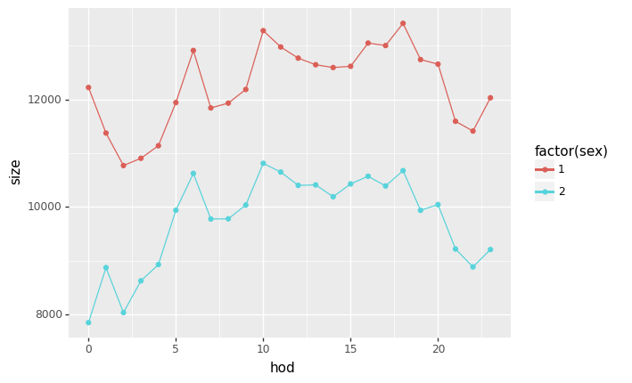
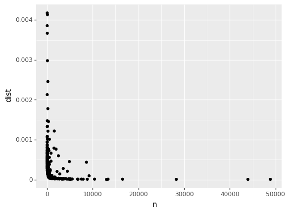
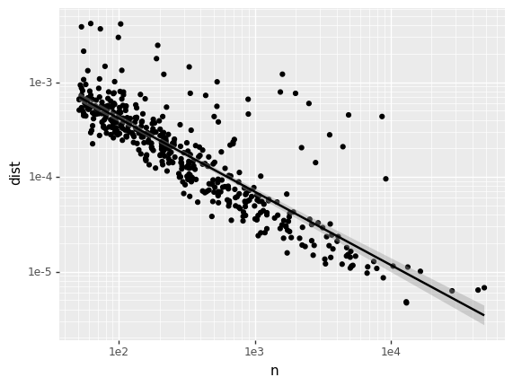
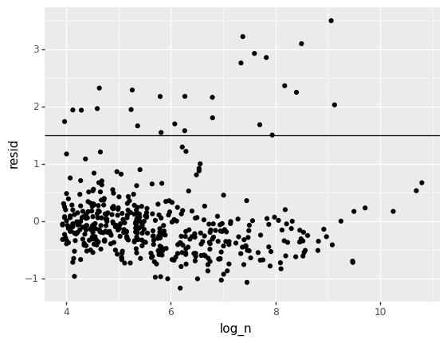
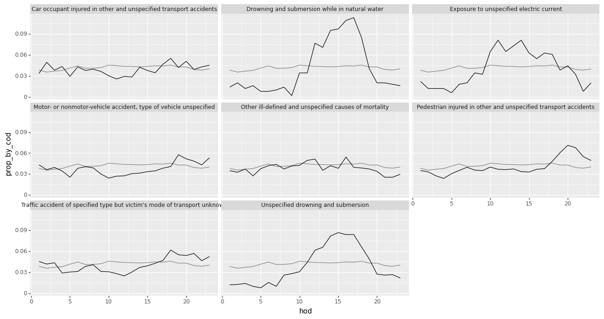

# APSC-5984 Lab 6: Tidy Data

Due: 2023-03-13 (Monday) 23:59:59

- [APSC-5984 Lab 6: Tidy Data](#apsc-5984-lab-6-tidy-data)
  - [0. Overview](#0-overview)
  - [1. Column headers are values, not variable names](#1-column-headers-are-values-not-variable-names)
    - [1.1 United States Census Bureau: 2017 National Population Projection](#11-united-states-census-bureau-2017-national-population-projection)
    - [1.2 Billboard top hits for 2000](#12-billboard-top-hits-for-2000)
  - [2. Multiple variables are stored in one column](#2-multiple-variables-are-stored-in-one-column)
    - [2.1 Tuberculosis (TB) dataset](#21-tuberculosis-tb-dataset)
  - [3. Variables are stored in both rows and columns](#3-variables-are-stored-in-both-rows-and-columns)
  - [4. Multiple types of observational units are stored in the same table](#4-multiple-types-of-observational-units-are-stored-in-the-same-table)
      - [Get the columns that contain only song information](#get-the-columns-that-contain-only-song-information)
      - [Get the columns that contain only song information](#get-the-columns-that-contain-only-song-information-1)
  - [5. A single observational unit is stored in multiple tables](#5-a-single-observational-unit-is-stored-in-multiple-tables)
  - [6. Case study](#6-case-study)
    - [6.1 Basic data exploration](#61-basic-data-exploration)
    - [6.2 Count the number of deaths in each hour](#62-count-the-number-of-deaths-in-each-hour)
    - [6.3 The proportion of deaths in each cause by hour](#63-the-proportion-of-deaths-in-each-cause-by-hour)
    - [6.4 The proportion of deaths in each hour](#64-the-proportion-of-deaths-in-each-hour)
    - [6.5 Deviation from the expected proportion](#65-deviation-from-the-expected-proportion)
    - [6.6 Use a residual plot to find unusual temporal patterns](#66-use-a-residual-plot-to-find-unusual-temporal-patterns)
    - [6.7 Visualize the unusual temporal patterns](#67-visualize-the-unusual-temporal-patterns)


## 0. Overview

Tidy data is an important concept in data science. We will go through each type of messy data discussed in the paper [Tidy Data](https://www.jstatsoft.org/article/view/v059i10/v59i10.pdf) and learn how to tidy them. We will not only use the `pandas` library to manipulate dataframes, but also use `plotnine`, which is a Python implementation of the `ggplot2` library in R, to visualize the tidy data.

First, let's import the libraries we will use in this section.


```python
import pandas as pd
import numpy as np
import re
import os
from plotnine import *
```

## 1. Column headers are values, not variable names

### 1.1 United States Census Bureau: 2017 National Population Projection

This is a dataset describing the projected population of the United States from 2016 to 2060. The first column `YEAR` keeps the year of the project. The remaining columns `POP_X` were used to store the projected population of each age `X` in the year, where `X` is an integer from 0 to 100.


```python
data = pd.read_csv("tidy_1_pop.csv")
data
```

        YEAR    POP_0    POP_1    POP_2    POP_3    POP_4    POP_5    POP_6  \
    0   2016  3970145  3995008  3992154  3982074  3987656  4032515  4029655
    1   2017  4054035  3982964  4008116  4003478  3992207  3997392  4042440
    2   2018  4075563  4068172  3995888  4019345  4013649  4001995  4007421
    3   2019  4095614  4089881  4082231  4006967  4029427  4023461  4012057
    4   2020  4113164  4110117  4104058  4094281  4016919  4039164  4033531

          POP_7    POP_8  ...   POP_91   POP_92   POP_93  POP_94  POP_95  POP_96  \
    0   4029991  4159114  ...   449986   372625   300000  239313  186408  135797
    1   4040047  4041063  ...   449945   382669   311525  246219  192531  146801
    2   4052927  4051175  ...   462335   382993   320285  256011  198354  151848
    3   4017972  4064123  ...   467488   393919   320884  263533  206526  156654
    4   4022626  4029209  ...   464985   398712   330389  264318  212880  163348

        POP_97  POP_98  POP_99  POP_100
    0    94311   68972   44895    81896
    1   104540   70840   50486    83574
    2   113165   78659   51938    86221
    3   117240   85265   57778    87671
    4   121128   88491   62724    92064

    [45 rows x 102 columns]


We can use `pd.melt()` to tidy the dataset. The `id_vars` argument specifies the columns that should not be melted. The `value_vars` argument specifies the columns that should be melted. In our case, `YEAR` is `id_vars` and the remaing columns are `value_vars`. We can specify the names of the melted columns using the `var_name` and `value_name` arguments.


```python
data_long = pd.melt(data,
                id_vars=["YEAR"],
                var_name="age",
                value_name="pop")
data_long
```


          YEAR      age      pop
    0     2016    POP_0  3970145
    1     2017    POP_0  4054035
    2     2018    POP_0  4075563
    3     2019    POP_0  4095614
    4     2020    POP_0  4113164
    ...    ...      ...      ...
    4540  2056  POP_100   505951
    4541  2057  POP_100   529280
    4542  2058  POP_100   549748
    4543  2059  POP_100   567379
    4544  2060  POP_100   589382
    
    [4545 rows x 3 columns]


By specifying the `value_vars` argument, we can only melt the columns we want.


```python
data_long = pd.melt(data,
                id_vars=["YEAR"],
                value_vars=["POP_1", "POP_2", "POP_3"],
                var_name="age",
                value_name="pop")
data_long
```

         YEAR    age      pop
    0    2016  POP_1  3995008
    1    2017  POP_1  3982964
    2    2018  POP_1  4068172
    3    2019  POP_1  4089881
    4    2020  POP_1  4110117
    ..    ...    ...      ...
    130  2056  POP_3  4401231
    131  2057  POP_3  4411893
    132  2058  POP_3  4421774
    133  2059  POP_3  4430923
    134  2060  POP_3  4439404
    
    [135 rows x 3 columns]


We can use `str.split()` to remove the prefix `POP_` from the `age` column.


```python
data_long["age"] = data_long["age"].apply(lambda x: x.split("_")[1])
data_long
```

         YEAR age      pop
    0    2016   1  3995008
    1    2017   1  3982964
    2    2018   1  4068172
    3    2019   1  4089881
    4    2020   1  4110117
    ..    ...  ..      ...
    130  2056   3  4401231
    131  2057   3  4411893
    132  2058   3  4421774
    133  2059   3  4430923
    134  2060   3  4439404
    
    [135 rows x 3 columns]


### 1.2 Billboard top hits for 2000

This dataset contains the song information of the top hits in 2000 and their rank by week. The ranks were organized in multiple columns (e.g., x1st.week, x2nd.week), where each column represents the rank of the song in a week.


```python
data = pd.read_csv("tidy_2_bboard.csv")
data
```


         year      artist.inverted                                  track   time  \
    0    2000      Destiny's Child               Independent Women Part I  03:38   
    1    2000              Santana                           Maria, Maria  04:18   
    2    2000        Savage Garden                     I Knew I Loved You  04:07   
    3    2000              Madonna                                  Music  03:45   
    4    2000  Aguilera, Christina  Come On Over Baby (All I Want Is You)  03:38   
    ..    ...                  ...                                    ...    ...   
    312  2000     Ghostface Killah                       Cherchez LaGhost  03:04   
    313  2000          Smith, Will                            Freakin' It  03:58   
    314  2000        Zombie Nation                          Kernkraft 400  03:30   
    315  2000       Eastsidaz, The                               Got Beef  03:58   
    316  2000               Fragma                         Toca's Miracle  03:22   
    
        genre date.entered date.peaked  x1st.week  x2nd.week  x3rd.week  ...  \
    0    Rock      9/23/00    11/18/00         78       63.0       49.0  ...   
    1    Rock      2/12/00      4/8/00         15        8.0        6.0  ...   
    2    Rock     10/23/99     1/29/00         71       48.0       43.0  ...   
    3    Rock      8/12/00     9/16/00         41       23.0       18.0  ...   
    4    Rock       8/5/00    10/14/00         57       47.0       45.0  ...   
    ..    ...          ...         ...        ...        ...        ...  ...   
    312   R&B       8/5/00      8/5/00         98        NaN        NaN  ...   
    313   Rap      2/12/00     2/12/00         99       99.0       99.0  ...   
    314  Rock       9/2/00      9/2/00         99       99.0        NaN  ...   
    315   Rap       7/1/00      7/1/00         99       99.0        NaN  ...   
    316   R&B     10/28/00    10/28/00         99        NaN        NaN  ...   

         x73rd.week  x74th.week  x75th.week  x76th.week  
    0           NaN         NaN         NaN         NaN  
    1           NaN         NaN         NaN         NaN  
    2           NaN         NaN         NaN         NaN  
    3           NaN         NaN         NaN         NaN  
    4           NaN         NaN         NaN         NaN  
    ..          ...         ...         ...         ...  
    312         NaN         NaN         NaN         NaN  
    313         NaN         NaN         NaN         NaN  
    314         NaN         NaN         NaN         NaN  
    315         NaN         NaN         NaN         NaN  
    316         NaN         NaN         NaN         NaN  
    
    [317 rows x 83 columns]


Again, let's identify the `id_vars` and `value_vars`. The `id_vars` are `year`, `artist.inverted`, `track`, `time`, `genre`, `date.entered`, and `date.peaked`. The `value_vars` are the remaining columns.


```python
id_vars = data.columns[:7]
data_long = data.melt(id_vars=id_vars, var_name="week", value_name="rank")
data_long = data_long.dropna()
data_long
```


           year      artist.inverted                                  track  \
    0      2000      Destiny's Child               Independent Women Part I
    1      2000              Santana                           Maria, Maria
    2      2000        Savage Garden                     I Knew I Loved You
    3      2000              Madonna                                  Music
    4      2000  Aguilera, Christina  Come On Over Baby (All I Want Is You)
    ...     ...                  ...                                    ...
    19663  2000             Lonestar                                 Amazed
    19700  2000                Creed                                 Higher
    19980  2000             Lonestar                                 Amazed
    20017  2000                Creed                                 Higher
    20334  2000                Creed                                 Higher

            time    genre date.entered date.peaked        week  rank
    0      03:38     Rock      9/23/00    11/18/00   x1st.week  78.0
    1      04:18     Rock      2/12/00      4/8/00   x1st.week  15.0
    2      04:07     Rock     10/23/99     1/29/00   x1st.week  71.0
    3      03:45     Rock      8/12/00     9/16/00   x1st.week  41.0
    4      03:38     Rock       8/5/00    10/14/00   x1st.week  57.0
    ...      ...      ...          ...         ...         ...   ...
    19663  04:25  Country       6/5/99      3/4/00  x63rd.week  45.0
    19700  05:16     Rock      9/11/99     7/22/00  x63rd.week  50.0
    19980  04:25  Country       6/5/99      3/4/00  x64th.week  50.0
    20017  05:16     Rock      9/11/99     7/22/00  x64th.week  50.0
    20334  05:16     Rock      9/11/99     7/22/00  x65th.week  49.0

    [5307 rows x 9 columns]


Refine the `week` column by removing the prefix `x` and the suffix `.week`.


```python
data_long["week"] = data_long["week"].apply(lambda x: re.findall(r"\d+", x)[0]).astype(int)
data_long["rank"] = data_long["rank"].astype(int)
data_long
```


           year      artist.inverted                                  track  \
    0      2000      Destiny's Child               Independent Women Part I   
    1      2000              Santana                           Maria, Maria   
    2      2000        Savage Garden                     I Knew I Loved You   
    3      2000              Madonna                                  Music   
    4      2000  Aguilera, Christina  Come On Over Baby (All I Want Is You)   
    ...     ...                  ...                                    ...   
    19663  2000             Lonestar                                 Amazed   
    19700  2000                Creed                                 Higher   
    19980  2000             Lonestar                                 Amazed   
    20017  2000                Creed                                 Higher   
    20334  2000                Creed                                 Higher   
    
            time    genre date.entered date.peaked  week  rank  
    0      03:38     Rock      9/23/00    11/18/00     1    78  
    1      04:18     Rock      2/12/00      4/8/00     1    15  
    2      04:07     Rock     10/23/99     1/29/00     1    71  
    3      03:45     Rock      8/12/00     9/16/00     1    41  
    4      03:38     Rock       8/5/00    10/14/00     1    57  
    ...      ...      ...          ...         ...   ...   ...  
    19663  04:25  Country       6/5/99      3/4/00    63    45  
    19700  05:16     Rock      9/11/99     7/22/00    63    50  
    19980  04:25  Country       6/5/99      3/4/00    64    50  
    20017  05:16     Rock      9/11/99     7/22/00    64    50  
    20334  05:16     Rock      9/11/99     7/22/00    65    49  
    
    [5307 rows x 9 columns]


## 2. Multiple variables are stored in one column

### 2.1 Tuberculosis (TB) dataset

This is a dataset describing the number of tuberculosis cases in different countries (column `country`) and years (column `year`). The remaining columns were coded in a format of `new_sp_xyyyy` where `x` is the gender and `yyyy` is numeric age range. For example, `new_sp_m014` kept the TB cases of male patients in the age range of 0-14.


```python
data = pd.read_csv("tidy_3_tb.csv")
data
```


         country  year   new_sp  new_sp_m04  new_sp_m514  new_sp_m014  \
    0         AD  1989      NaN         NaN          NaN          NaN   
    1         AD  1990      NaN         NaN          NaN          NaN   
    2         AD  1991      NaN         NaN          NaN          NaN   
    3         AD  1992      NaN         NaN          NaN          NaN   
    4         AD  1993     15.0         NaN          NaN          NaN   
    ...      ...   ...      ...         ...          ...          ...   
    5764      ZW  2004  14581.0         NaN          NaN        187.0   
    5765      ZW  2005  13155.0         NaN          NaN        210.0   
    5766      ZW  2006  12718.0         NaN          NaN        215.0   
    5767      ZW  2007  10583.0         6.0        132.0        138.0   
    5768      ZW  2008   9830.0         NaN          NaN        127.0   
    
          new_sp_m1524  new_sp_m2534  new_sp_m3544  new_sp_m4554  ...  new_sp_f04  \
    0              NaN           NaN           NaN           NaN  ...         NaN   
    1              NaN           NaN           NaN           NaN  ...         NaN   
    2              NaN           NaN           NaN           NaN  ...         NaN   
    3              NaN           NaN           NaN           NaN  ...         NaN   
    4              NaN           NaN           NaN           NaN  ...         NaN   
    ...            ...           ...           ...           ...  ...         ...   
    5764         833.0        2908.0        2298.0        1056.0  ...         NaN   
    5765         837.0        2264.0        1855.0         762.0  ...         NaN   
    5766         736.0        2391.0        1939.0         896.0  ...         NaN   
    5767         500.0        3693.0           0.0         716.0  ...         7.0   
    5768         614.0           0.0        3316.0         704.0  ...         NaN   
    
          new_sp_f514  new_sp_f014  new_sp_f1524  new_sp_f2534  new_sp_f3544  \
    0             NaN          NaN           NaN           NaN           NaN   
    1             NaN          NaN           NaN           NaN           NaN   
    2             NaN          NaN           NaN           NaN           NaN   
    3             NaN          NaN           NaN           NaN           NaN   
    4             NaN          NaN           NaN           NaN           NaN   
    ...           ...          ...           ...           ...           ...   
    5764          NaN        225.0        1140.0        2858.0        1565.0   
    5765          NaN        269.0        1136.0        2242.0        1255.0   
    5766          NaN        237.0        1020.0        2424.0        1355.0   
    5767        178.0        185.0         739.0        3311.0           0.0   
    5768          NaN        145.0         840.0           0.0        2890.0   
    
          new_sp_f4554  new_sp_f5564  new_sp_f65  new_sp_fu  
    0              NaN           NaN         NaN        NaN  
    1              NaN           NaN         NaN        NaN  
    2              NaN           NaN         NaN        NaN  
    3              NaN           NaN         NaN        NaN  
    4              NaN           NaN         NaN        NaN  
    ...            ...           ...         ...        ...  
    5764         622.0         214.0       111.0        NaN  
    5765         578.0         193.0       603.0        NaN  
    5766         632.0         230.0        96.0        NaN  
    5767         553.0         213.0        90.0        NaN  
    5768         467.0         174.0       105.0        0.0  
    
    [5769 rows x 23 columns]


Let's first tidy the columns of TB cases.


```python
data_long = data.melt(id_vars=["country", "year"]).dropna()
data_long
```


           country  year   variable  value
    4           AD  1993     new_sp   15.0
    5           AD  1994     new_sp   24.0
    6           AD  1996     new_sp    8.0
    7           AD  1997     new_sp   17.0
    8           AD  1998     new_sp    1.0
    ...        ...   ...        ...    ...
    120964      VU  2008  new_sp_fu    0.0
    121038      YE  2008  new_sp_fu    0.0
    121092      ZA  2008  new_sp_fu    0.0
    121119      ZM  2008  new_sp_fu    0.0
    121148      ZW  2008  new_sp_fu    0.0
    
    [38619 rows x 4 columns]


Remove redundant columns.


```python
data_long2 = data_long.query("variable not in ['new_sp', 'new_sp_mu', 'new_sp_fu']")
data_long2
```


           country  year    variable  value
    5784        AD  2005  new_sp_m04    0.0
    5785        AD  2006  new_sp_m04    0.0
    5787        AD  2008  new_sp_m04    0.0
    5811        AE  2006  new_sp_m04    0.0
    5812        AE  2007  new_sp_m04    0.0
    ...        ...   ...         ...    ...
    115375      ZW  2004  new_sp_f65  111.0
    115376      ZW  2005  new_sp_f65  603.0
    115377      ZW  2006  new_sp_f65   96.0
    115378      ZW  2007  new_sp_f65   90.0
    115379      ZW  2008  new_sp_f65  105.0
    
    [35009 rows x 4 columns]


Then, format the `variable` column to `gender` and `age`. 


```python
data_long2["age"] = data_long2["variable"].\
    apply(lambda x: re.findall(r"\d+", x.replace("new_sp_", ""))[0])
data_long2["gender"] = data_long2["variable"].\
    apply(lambda x: re.findall(r"[mf]+", x.replace("new_sp_", ""))[0])
data_long2
```


           country  year    variable  value age gender
    5784        AD  2005  new_sp_m04    0.0  04      m
    5785        AD  2006  new_sp_m04    0.0  04      m
    5787        AD  2008  new_sp_m04    0.0  04      m
    5811        AE  2006  new_sp_m04    0.0  04      m
    5812        AE  2007  new_sp_m04    0.0  04      m
    ...        ...   ...         ...    ...  ..    ...
    115375      ZW  2004  new_sp_f65  111.0  65      f
    115376      ZW  2005  new_sp_f65  603.0  65      f
    115377      ZW  2006  new_sp_f65   96.0  65      f
    115378      ZW  2007  new_sp_f65   90.0  65      f
    115379      ZW  2008  new_sp_f65  105.0  65      f
    
    [35009 rows x 6 columns]


## 3. Variables are stored in both rows and columns

This is a scenario where variables are stored in both rows and columns. We will work on the `weather` dataset to demonstrate how to tidy this type of data. Since this dataset did not have a column header, we will use the `columns` attribute to specify the column names.


```python
data = pd.read_csv("tidy_4_weather.csv", header=None)
nrow, ncol = data.shape
data.columns = ["idx"] + [i for i in range(1, ncol)]
data
```


                           idx    1    2    3    4    5    6    7    8    9  ...  \
    0    MX000017004195504TMIN  150  150  160  150  160  160  160  160  160  ...   
    1    MX000017004195504PRCP    0    0    0    0    0    0    0    0    0  ...   
    2    MX000017004195505TMAX  310  310  310  300  300  300  310  310  310  ...   
    3    MX000017004195505TMIN  200  160  160  150  150  150  160  160  170  ...   
    4    MX000017004195505PRCP    0    0    0    0    0    0    0    0    0  ...   
    ..                     ...  ...  ...  ...  ...  ...  ...  ...  ...  ...  ...   
    994  MX000017004199004TMIN    0  147  147  150  136    0  157    0    0  ...   
    995  MX000017004199004PRCP    0    0    0    0   23    0    0    0    0  ...   
    996  MX000017004199005TMAX    0  350  362  348  337    0  240    0    0  ...   
    997  MX000017004199005TMIN  168  168  167  167  170    0  132  132    0  ...   
    998  MX000017004199005PRCP    0    0    0    0   61    0  254   20    0  ...   
    
          22   23   24   25   26   27   28   29   30   31  
    0    170  170  170  180  190  190  170  180  160    0  
    1      0    0    0    0    0    0    0    0    6    0  
    2    330  340  350  330  310  310  320  310  300  290  
    3    170  190  190  190  180  160  150  170  150  160  
    4      0    0    0    0    0  142    0   54    0   46  
    ..   ...  ...  ...  ...  ...  ...  ...  ...  ...  ...  
    994    0    0    0    0    0    0    0    0  157    0  
    995    0    0    0    0    0    0    0    0    0    0  
    996    0  297    0    0    0    0    0    0    0  336  
    997  144  136  136  155  155    0    0  166  179  169  
    998    0   89    0    0    0    0    0    0    0    3  
    
    [999 rows x 32 columns]


You should notice that the column `idx` contains complicated information: `station ID`, `year`, `month`, and `day`. We can use simple indexing to extract the information we want.


```python
data["site"] = data["idx"].apply(lambda x: x[:11])
data["year"] = data["idx"].apply(lambda x: x[-10:-6]).astype(int)
data["month"] = data["idx"].apply(lambda x: x[-6:-4]).astype(int)
data["variable"] = data["idx"].apply(lambda x: x[-4:])
data = data.drop("idx", axis=1)
data
```


           1    2    3    4    5    6    7    8    9   10  ...   26   27   28  \
    0    150  150  160  150  160  160  160  160  160  170  ...  190  190  170   
    1      0    0    0    0    0    0    0    0    0    0  ...    0    0    0   
    2    310  310  310  300  300  300  310  310  310  300  ...  310  310  320   
    3    200  160  160  150  150  150  160  160  170  170  ...  180  160  150   
    4      0    0    0    0    0    0    0    0    0    0  ...    0  142    0   
    ..   ...  ...  ...  ...  ...  ...  ...  ...  ...  ...  ...  ...  ...  ...   
    994    0  147  147  150  136    0  157    0    0  157  ...    0    0    0   
    995    0    0    0    0   23    0    0    0    0    0  ...    0    0    0   
    996    0  350  362  348  337    0  240    0    0    0  ...    0    0    0   
    997  168  168  167  167  170    0  132  132    0    0  ...  155    0    0   
    998    0    0    0    0   61    0  254   20    0    5  ...    0    0    0   
    
          29   30   31         site  year  month  variable  
    0    180  160    0  MX000017004  1955      4      TMIN  
    1      0    6    0  MX000017004  1955      4      PRCP  
    2    310  300  290  MX000017004  1955      5      TMAX  
    3    170  150  160  MX000017004  1955      5      TMIN  
    4     54    0   46  MX000017004  1955      5      PRCP  
    ..   ...  ...  ...          ...   ...    ...       ...  
    994    0  157    0  MX000017004  1990      4      TMIN  
    995    0    0    0  MX000017004  1990      4      PRCP  
    996    0    0  336  MX000017004  1990      5      TMAX  
    997  166  179  169  MX000017004  1990      5      TMIN  
    998    0    0    3  MX000017004  1990      5      PRCP  
    
    [999 rows x 35 columns]


Now, let's tidy the date information.


```python
data2 = data.melt(id_vars=["site", "year", "month", "variable"], var_name="day", value_name="value")
data2["day"] = data2["day"].astype(int)
data2
```


                  site  year  month variable  day  value
    0      MX000017004  1955      4     TMIN    1    150
    1      MX000017004  1955      4     PRCP    1      0
    2      MX000017004  1955      5     TMAX    1    310
    3      MX000017004  1955      5     TMIN    1    200
    4      MX000017004  1955      5     PRCP    1      0
    ...            ...   ...    ...      ...  ...    ...
    30964  MX000017004  1990      4     TMIN   31      0
    30965  MX000017004  1990      4     PRCP   31      0
    30966  MX000017004  1990      5     TMAX   31    336
    30967  MX000017004  1990      5     TMIN   31    169
    30968  MX000017004  1990      5     PRCP   31      3
    
    [30969 rows x 6 columns]


Now, since there are three variables: `tmax`, `tmin`, and `prcp` in the `variable` column, we need to pivot it to the column names.

We can use `df.pivot()` to do this. The `index` argument specifies the columns that should not be pivoted. The `columns` argument specifies the columns that should be pivoted. The `values` argument specifies the column that should be used as the values of the pivoted columns.


```python
data3 = data2.pivot(index = ["site", "year", "month", "day"], columns = "variable", values="value")
data3 = data3.reset_index().dropna()
data3
```


    variable         site  year  month  day  PRCP   TMAX   TMIN
    31        MX000017004  1955      5    1   0.0  310.0  200.0
    32        MX000017004  1955      5    2   0.0  310.0  160.0
    33        MX000017004  1955      5    3   0.0  310.0  160.0
    34        MX000017004  1955      5    4   0.0  300.0  150.0
    35        MX000017004  1955      5    5   0.0  300.0  150.0
    ...               ...   ...    ...  ...   ...    ...    ...
    10411     MX000017004  1990      5   27   0.0    0.0    0.0
    10412     MX000017004  1990      5   28   0.0    0.0    0.0
    10413     MX000017004  1990      5   29   0.0    0.0  166.0
    10414     MX000017004  1990      5   30   0.0    0.0  179.0
    10415     MX000017004  1990      5   31   3.0  336.0  169.0
    
    [10230 rows x 7 columns]


## 4. Multiple types of observational units are stored in the same table

Let's revisit the billboard dataset that we worked in the second type of messy data. Although we have tidied the dataset, we can still see many repeated values in the data. For example, if we only check records of the song "Maria, Maria", we can see that multiple columns, such as `artist.inverted` and `track`, were repeated for each week.


```python
data = pd.read_csv("tidy_5_bboard_long.csv")
data
```


           year      artist.inverted                                  track  \
    0      2000      Destiny's Child               Independent Women Part I   
    1      2000              Santana                           Maria, Maria   
    2      2000        Savage Garden                     I Knew I Loved You   
    3      2000              Madonna                                  Music   
    4      2000  Aguilera, Christina  Come On Over Baby (All I Want Is You)   
    ...     ...                  ...                                    ...   
    24087  2000     Ghostface Killah                       Cherchez LaGhost   
    24088  2000          Smith, Will                            Freakin' It   
    24089  2000        Zombie Nation                          Kernkraft 400   
    24090  2000       Eastsidaz, The                               Got Beef   
    24091  2000               Fragma                         Toca's Miracle   
    
            time genre date.entered date.peaked  week  rank  
    0      03:38  Rock      9/23/00    11/18/00     1  78.0  
    1      04:18  Rock      2/12/00      4/8/00     1  15.0  
    2      04:07  Rock     10/23/99     1/29/00     1  71.0  
    3      03:45  Rock      8/12/00     9/16/00     1  41.0  
    4      03:38  Rock       8/5/00    10/14/00     1  57.0  
    ...      ...   ...          ...         ...   ...   ...  
    24087  03:04   R&B       8/5/00      8/5/00    76   NaN  
    24088  03:58   Rap      2/12/00     2/12/00    76   NaN  
    24089  03:30  Rock       9/2/00      9/2/00    76   NaN  
    24090  03:58   Rap       7/1/00      7/1/00    76   NaN  
    24091  03:22   R&B     10/28/00    10/28/00    76   NaN  
    
    [24092 rows x 9 columns]


```python
data.query("track == 'Maria, Maria'")
```


           year artist.inverted         track   time genre date.entered  \
    1      2000         Santana  Maria, Maria  04:18  Rock      2/12/00   
    318    2000         Santana  Maria, Maria  04:18  Rock      2/12/00   
    635    2000         Santana  Maria, Maria  04:18  Rock      2/12/00   
    952    2000         Santana  Maria, Maria  04:18  Rock      2/12/00   
    1269   2000         Santana  Maria, Maria  04:18  Rock      2/12/00   
    ...     ...             ...           ...    ...   ...          ...   
    22508  2000         Santana  Maria, Maria  04:18  Rock      2/12/00   
    22825  2000         Santana  Maria, Maria  04:18  Rock      2/12/00   
    23142  2000         Santana  Maria, Maria  04:18  Rock      2/12/00   
    23459  2000         Santana  Maria, Maria  04:18  Rock      2/12/00   
    23776  2000         Santana  Maria, Maria  04:18  Rock      2/12/00   
    
          date.peaked  week  rank  
    1          4/8/00     1  15.0  
    318        4/8/00     2   8.0  
    635        4/8/00     3   6.0  
    952        4/8/00     4   5.0  
    1269       4/8/00     5   2.0  
    ...           ...   ...   ...  
    22508      4/8/00    72   NaN  
    22825      4/8/00    73   NaN  
    23142      4/8/00    74   NaN  
    23459      4/8/00    75   NaN  
    23776      4/8/00    76   NaN  
    
    [76 rows x 9 columns]


You can observe duplicated information being stored for the song "Maria, Maria". We need a separate table to store the song information only once.

#### Get the columns that contain only song information


```python
header_idx = ["year", "artist.inverted", "track", "time", "genre", "date.entered", "date.peaked"]
data_song = data.loc[:, header_idx]
data_song
```


           year      artist.inverted                                  track  \
    0      2000      Destiny's Child               Independent Women Part I   
    1      2000              Santana                           Maria, Maria   
    2      2000        Savage Garden                     I Knew I Loved You   
    3      2000              Madonna                                  Music   
    4      2000  Aguilera, Christina  Come On Over Baby (All I Want Is You)   
    ...     ...                  ...                                    ...   
    24087  2000     Ghostface Killah                       Cherchez LaGhost   
    24088  2000          Smith, Will                            Freakin' It   
    24089  2000        Zombie Nation                          Kernkraft 400   
    24090  2000       Eastsidaz, The                               Got Beef   
    24091  2000               Fragma                         Toca's Miracle   
    
            time genre date.entered date.peaked  
    0      03:38  Rock      9/23/00    11/18/00  
    1      04:18  Rock      2/12/00      4/8/00  
    2      04:07  Rock     10/23/99     1/29/00  
    3      03:45  Rock      8/12/00     9/16/00  
    4      03:38  Rock       8/5/00    10/14/00  
    ...      ...   ...          ...         ...  
    24087  03:04   R&B       8/5/00      8/5/00  
    24088  03:58   Rap      2/12/00     2/12/00  
    24089  03:30  Rock       9/2/00      9/2/00  
    24090  03:58   Rap       7/1/00      7/1/00  
    24091  03:22   R&B     10/28/00    10/28/00  
    
    [24092 rows x 7 columns]


Drop the duplicated rows using `pd.drop_duplicates()`. Check the row count of the new dataframe.


```python
data_song = data_song.drop_duplicates()
data_song
```


         year      artist.inverted                                  track   time  \
    0    2000      Destiny's Child               Independent Women Part I  03:38   
    1    2000              Santana                           Maria, Maria  04:18   
    2    2000        Savage Garden                     I Knew I Loved You  04:07   
    3    2000              Madonna                                  Music  03:45   
    4    2000  Aguilera, Christina  Come On Over Baby (All I Want Is You)  03:38   
    ..    ...                  ...                                    ...    ...   
    312  2000     Ghostface Killah                       Cherchez LaGhost  03:04   
    313  2000          Smith, Will                            Freakin' It  03:58   
    314  2000        Zombie Nation                          Kernkraft 400  03:30   
    315  2000       Eastsidaz, The                               Got Beef  03:58   
    316  2000               Fragma                         Toca's Miracle  03:22   
    
        genre date.entered date.peaked  
    0    Rock      9/23/00    11/18/00  
    1    Rock      2/12/00      4/8/00  
    2    Rock     10/23/99     1/29/00  
    3    Rock      8/12/00     9/16/00  
    4    Rock       8/5/00    10/14/00  
    ..    ...          ...         ...  
    312   R&B       8/5/00      8/5/00  
    313   Rap      2/12/00     2/12/00  
    314  Rock       9/2/00      9/2/00  
    315   Rap       7/1/00      7/1/00  
    316   R&B     10/28/00    10/28/00  
    
    [317 rows x 7 columns]


We need to create a numeric index for the song table, because we will use it as a `foreign key` in the ranking table. Use `pd.reset_index()` to create a new column `index` and use it as the index of the song table.


```python
data_song = data_song.reset_index()
data_song
```


         index  year      artist.inverted                                  track  \
    0        0  2000      Destiny's Child               Independent Women Part I   
    1        1  2000              Santana                           Maria, Maria   
    2        2  2000        Savage Garden                     I Knew I Loved You   
    3        3  2000              Madonna                                  Music   
    4        4  2000  Aguilera, Christina  Come On Over Baby (All I Want Is You)   
    ..     ...   ...                  ...                                    ...   
    312    312  2000     Ghostface Killah                       Cherchez LaGhost   
    313    313  2000          Smith, Will                            Freakin' It   
    314    314  2000        Zombie Nation                          Kernkraft 400   
    315    315  2000       Eastsidaz, The                               Got Beef   
    316    316  2000               Fragma                         Toca's Miracle   
    
          time genre date.entered date.peaked  
    0    03:38  Rock      9/23/00    11/18/00  
    1    04:18  Rock      2/12/00      4/8/00  
    2    04:07  Rock     10/23/99     1/29/00  
    3    03:45  Rock      8/12/00     9/16/00  
    4    03:38  Rock       8/5/00    10/14/00  
    ..     ...   ...          ...         ...  
    312  03:04   R&B       8/5/00      8/5/00  
    313  03:58   Rap      2/12/00     2/12/00  
    314  03:30  Rock       9/2/00      9/2/00  
    315  03:58   Rap       7/1/00      7/1/00  
    316  03:22   R&B     10/28/00    10/28/00  
    
    [317 rows x 8 columns]


Merge the `data_song` and the original `data` using `pd.merge()`. Now, we get the numeric index for each song in the ranking table.

https://pandas.pydata.org/pandas-docs/stable/reference/api/pandas.DataFrame.merge.html


```python
data_merge = pd.merge(data_song, data, on=header_idx)
data_merge
```


           index  year  artist.inverted                     track   time genre  \
    0          0  2000  Destiny's Child  Independent Women Part I  03:38  Rock   
    1          0  2000  Destiny's Child  Independent Women Part I  03:38  Rock   
    2          0  2000  Destiny's Child  Independent Women Part I  03:38  Rock   
    3          0  2000  Destiny's Child  Independent Women Part I  03:38  Rock   
    4          0  2000  Destiny's Child  Independent Women Part I  03:38  Rock   
    ...      ...   ...              ...                       ...    ...   ...   
    24087    316  2000           Fragma            Toca's Miracle  03:22   R&B   
    24088    316  2000           Fragma            Toca's Miracle  03:22   R&B   
    24089    316  2000           Fragma            Toca's Miracle  03:22   R&B   
    24090    316  2000           Fragma            Toca's Miracle  03:22   R&B   
    24091    316  2000           Fragma            Toca's Miracle  03:22   R&B   
    
          date.entered date.peaked  week  rank  
    0          9/23/00    11/18/00     1  78.0  
    1          9/23/00    11/18/00     2  63.0  
    2          9/23/00    11/18/00     3  49.0  
    3          9/23/00    11/18/00     4  33.0  
    4          9/23/00    11/18/00     5  23.0  
    ...            ...         ...   ...   ...  
    24087     10/28/00    10/28/00    72   NaN  
    24088     10/28/00    10/28/00    73   NaN  
    24089     10/28/00    10/28/00    74   NaN  
    24090     10/28/00    10/28/00    75   NaN  
    24091     10/28/00    10/28/00    76   NaN  
    
    [24092 rows x 10 columns]

#### Get the columns that contain only song information


Finally, we can drop the song information to get the ranking table, which is indexed by the numeric index column: `index`.


```python
data_rank = data_merge.loc[:, ["index", "week", "rank"]]
data_rank
```


           index  week  rank
    0          0     1  78.0
    1          0     2  63.0
    2          0     3  49.0
    3          0     4  33.0
    4          0     5  23.0
    ...      ...   ...   ...
    24087    316    72   NaN
    24088    316    73   NaN
    24089    316    74   NaN
    24090    316    75   NaN
    24091    316    76   NaN
    
    [24092 rows x 3 columns]


We can compare the number of values we need before and after the transformation.


```python
size_original = data.size
size_new = data_rank.size + data_song.size

print("The number of elements (number of rows times number of columns) in data is ", size_original)
print("New data has ", size_new, "elements")
print("Compression ratio is ",   size_new / size_original)
```

    The number of elements (number of rows times number of columns) in data is  216828
    New data has  74812 elements
    Compression ratio is  0.34502923976608185


## 5. A single observational unit is stored in multiple tables

This is a case where a single observational unit is stored in multiple tables organized by different variables. In this example, we will work on the `babynames` dataset. This dataset consists of multiple files, each of which contains the baby names and their proportions. The files are organized by year and gender in a format of `babynames_yyyy_xxx.csv`, where `yyyy` is the year and `xxx` is the gender (i.e., boy or girl).

Let's bbserve the file naming pattern first


```python
os.listdir("tidy_6_babynames")
```


    ['babynames_1887_boy.csv',
     'babynames_1897_boy.csv',
     'babynames_1959_girl.csv',
     'babynames_1958_girl.csv',
     'babynames_1946_boy.csv',
     'babynames_1956_boy.csv',
     'babynames_1982_girl.csv',
     ...
     'babynames_1931_boy.csv',
     'babynames_1921_boy.csv',
     'babynames_1974_girl.csv',
     'babynames_1975_girl.csv',
     'babynames_1988_boy.csv',
     'babynames_1998_boy.csv']


We can try to open one of them to inspect the data.


```python
pd.read_csv(os.path.join("tidy_6_babynames", "babynames_1887_boy.csv"))
```


            name   percent
    0       John  0.074181
    1    William  0.068344
    2      James  0.043617
    3     George  0.039190
    4    Charles  0.036875
    ..       ...       ...
    995   Jessee  0.000046
    996    Jewel  0.000046
    997    Jodie  0.000046
    998     Lars  0.000046
    999   Laurel  0.000046
    
    [1000 rows x 2 columns]


You will find that there is no year or gender information in the file, we need to extract them from the file name. Let's start with a single file to experiment the extraction process.


```python
filename = "babynames_1887_boy.csv"
year = re.findall(r"\d+", filename)[0]
gender = re.findall(r"[a-z]+\.", filename)[0].replace(".", "")
data = pd.read_csv(os.path.join("tidy_6_babynames", filename))
data["year"] = year
data["gender"] = gender
data
```


            name   percent  year gender
    0       John  0.074181  1887    boy
    1    William  0.068344  1887    boy
    2      James  0.043617  1887    boy
    3     George  0.039190  1887    boy
    4    Charles  0.036875  1887    boy
    ..       ...       ...   ...    ...
    995   Jessee  0.000046  1887    boy
    996    Jewel  0.000046  1887    boy
    997    Jodie  0.000046  1887    boy
    998     Lars  0.000046  1887    boy
    999   Laurel  0.000046  1887    boy
    
    [1000 rows x 4 columns]


Now, we can iteratively extract needed information from each file and store them into one csv file. We can create an empty file with only the header defined.


```python
FILE_OUT = "tidy_6_babynames.csv"
with open(FILE_OUT, "w") as f:
    f.write("name,percent,year,gender\n")
```

Next, let's test the extraction process on the first five files. Try to define constant variables instead of hard-coding the values every time.


```python
DIR_DATA = "tidy_6_babynames"
ls_files = os.listdir(DIR_DATA)
for filename in ls_files:
    year = re.findall(r"\d+", filename)[0]
    gender = re.findall(r"[a-z]+\.", filename)[0].replace(".", "")
    data = pd.read_csv(os.path.join(DIR_DATA, filename))
    data["year"] = year
    data["gender"] = gender
    data.to_csv(FILE_OUT, mode="a", header=False, index=False)
```

Examine the extracted data.


```python
data = pd.read_csv(FILE_OUT)
data.info()
```

    <class 'pandas.core.frame.DataFrame'>
    RangeIndex: 258000 entries, 0 to 257999
    Data columns (total 4 columns):
     #   Column   Non-Null Count   Dtype  
    ---  ------   --------------   -----  
     0   name     258000 non-null  object 
     1   percent  258000 non-null  float64
     2   year     258000 non-null  int64  
     3   gender   258000 non-null  object 
    dtypes: float64(1), int64(1), object(2)
    memory usage: 7.9+ MB


```python
data["year"].value_counts()
```


    1887    2000
    1977    2000
    1972    2000
    1986    2000
    1996    2000
            ... 
    1913    2000
    1906    2000
    1907    2000
    2000    2000
    1991    2000
    Name: year, Length: 129, dtype: int64


```python
data["gender"].value_counts()
```


    boy     129000
    girl    129000
    Name: gender, dtype: int64


```python
data.groupby(["year", "gender"]).agg({"percent": "sum"})
```


                  percent
    year gender          
    1880 boy     0.930746
         girl    0.934546
    1881 boy     0.930439
         girl    0.932690
    1882 boy     0.927532
    ...               ...
    2006 girl    0.684830
    2007 boy     0.801105
         girl    0.677453
    2008 boy     0.795414
         girl    0.672516
    
    [258 rows x 1 columns]


## 6. Case study

We will use a case study to illustrate the advantages of tidying data. The dataset `tidy_X.csv` contains the individual-level mortality from Mexico.
The columns include the following:

- `sex`: the gender of the deceased
- `age`: the age of the deceased
- `yod`: the year of death
- `mod`: the month of death
- `dod`: the day of death
- `hod`: the hour of death
- `cod`: the cause of death

The goal is to find causes of death with unusual temporal patterns within a day.

### 6.1 Basic data exploration
Let's read the data first.


```python
data = pd.read_csv("tidy_X.csv")
data
```


            sex  age   yod  mod  dod  hod  cod
    0         1   90  2008    1    7   20  F17
    1         1   72  2008    1   13   14  I05
    2         1   49  2008    1   12   20  K65
    3         2   79  2008    1   20   10  I38
    4         1   15  2008    1    1   15  N18
    ...     ...  ...   ...  ...  ...  ...  ...
    528323    1    1  2008   10    6   12  P22
    528324    2   20  2008   10   18   20  Q24
    528325    2    3  2008   11   11   19  P22
    528326    1   24  2008    9   25   12  P22
    528327    1    2  2008    9   22   16  P26
    
    [528328 rows x 7 columns]


Check the data types of the columns.


```python
data.info()
```

    <class 'pandas.core.frame.DataFrame'>
    RangeIndex: 528328 entries, 0 to 528327
    Data columns (total 7 columns):
     #   Column  Non-Null Count   Dtype 
    ---  ------  --------------   ----- 
     0   sex     528328 non-null  int64 
     1   age     528328 non-null  int64 
     2   yod     528328 non-null  int64 
     3   mod     528328 non-null  int64 
     4   dod     528328 non-null  int64 
     5   hod     528328 non-null  int64 
     6   cod     528328 non-null  object
    dtypes: int64(6), object(1)
    memory usage: 28.2+ MB


```python
data.describe()
```


                     sex            age            yod            mod  \
    count  528328.000000  528328.000000  528328.000000  528328.000000
    mean        1.443461      61.246593    2007.950735       6.490457
    std         0.496794      24.611694       2.881578       3.554002
    min         1.000000       1.000000       0.000000       0.000000
    25%         1.000000      48.000000    2008.000000       3.000000
    50%         1.000000      67.000000    2008.000000       6.000000
    75%         2.000000      80.000000    2008.000000      10.000000
    max         2.000000      99.000000    2008.000000      12.000000

                     dod            hod
    count  528328.000000  528328.000000
    mean       15.738475      11.701500
    std         8.826922       6.763691
    min         0.000000       0.000000
    25%         8.000000       6.000000
    50%        16.000000      12.000000
    75%        23.000000      17.000000
    max        31.000000      23.000000


What if we want to examine the difference between the genders over the day? We can group `hod` and `sex` to calculate the counts of deaths in each hour.


```python
data_grp = data.groupby(["hod", "sex"]).agg(size=("hod", lambda x: len(x))).reset_index()
data_grp.query("sex == 1")
```


        hod  sex   size
    0     0    1  12224
    2     1    1  11376
    4     2    1  10771
    6     3    1  10906
    8     4    1  11140
    10    5    1  11943
    12    6    1  12912
    14    7    1  11843
    16    8    1  11933
    18    9    1  12187
    20   10    1  13281
    22   11    1  12977
    24   12    1  12770
    26   13    1  12647
    28   14    1  12595
    30   15    1  12618
    32   16    1  13050
    34   17    1  13004
    36   18    1  13417
    38   19    1  12743
    40   20    1  12658
    42   21    1  11595
    44   22    1  11413
    46   23    1  12032


We can use `plotnine`, a Python version of `ggplot2`, to visualize the data.


```python
from plotnine import *
ggplot(data_grp, aes(x="hod", y="size", color="factor(sex)")) + geom_point() + geom_line()
```


    

    


    <ggplot: (706404852)>


### 6.2 Count the number of deaths in each hour

We need to tidy the data by `hod` and `cod` to get the number of deaths in each hour. Before we do that, we can use `df.query()` to check what result we will get. For example, there should be five records of hod=0, and cod=A06.


```python
data.query("hod == 0 and cod == 'A06'")
```


            sex  age   yod  mod  dod  hod  cod
    19640     2   88  2008    1   10    0  A06
    298031    1   56  2008   12   28    0  A06
    395562    2   22  2008   12   20    0  A06
    412156    1   83  2008    1    5    0  A06
    502497    1    2  2008    7   19    0  A06


Then use `df.groupby()` to group the data by `hod` and `cod` and aggregate the data by `size` to count the number of deaths. We should see "5" in the `freq_by_hodcod` column as we queried above.


```python
data_grp = data.groupby(["hod", "cod"]).agg(freq_by_hodcod=("hod", "size")).reset_index()
data_grp
```


           hod  cod  freq_by_hodcod
    0        0  A02               1
    1        0  A04               6
    2        0  A06               5
    3        0  A09              87
    4        0  A15               7
    ...    ...  ...             ...
    16171   23  Y34              28
    16172   23  Y57               3
    16173   23  Y83               7
    16174   23  Y86              16
    16175   23  Y89               5
    
    [16176 rows x 3 columns]


It is equivalent to use `lambda` function to define the counting function.


```python
data_grp = data.groupby(["hod", "cod"]).agg(freq_by_hodcod=("hod", lambda x: len(x))).reset_index()
data_grp
```


           hod  cod  freq_by_hodcod
    0        0  A02               1
    1        0  A04               6
    2        0  A06               5
    3        0  A09              91
    4        0  A15               7
    ...    ...  ...             ...
    16702   99  Y33               2
    16703   99  Y34              99
    16704   99  Y40               1
    16705   99  Y57               3
    16706   99  Y86               2
    
    [16707 rows x 3 columns]


### 6.3 The proportion of deaths in each cause by hour

Now, let's continue with the `data_grp` to compute proportion of deaths of each `cod` given `hod`. We need to determine the denominator of the proportion first. The denominator is the total number of deaths in each `cod` across all `hod`.

Again, we can use `df.query()` to preview what we will get.


```python
data_grp.query("cod == 'A03'")
```


           hod  cod  freq_by_hodcod
    5257     8  A03               1
    5922     9  A03               1
    6611    10  A03               1
    8014    12  A03               1
    11503   17  A03               1
    12204   18  A03               1
    14210   21  A03               1


Then use `df.groupby()` to group the data by `cod` and aggregate the data by `sum` to get the total number of deaths in each `cod`.


```python
sum_cod = data_grp.groupby(["cod"]).agg(sum_by_cod=("freq_by_hodcod", "sum")).reset_index()
sum_cod
```


    
          cod  sum_by_cod
    0     A01          51
    1     A02          62
    2     A03           7
    3     A04         144
    4     A05          20
    ...   ...         ...
    1192  Y85           4
    1193  Y86         363
    1194  Y87           2
    1195  Y88           5
    1196  Y89          39
    
    [1197 rows x 2 columns]


We use `df.merge()` to merge the `data_grp` and the `sum_cod` to put the sum of deaths in each `cod` into the `data_grp` table.


```python
data_grp2 = pd.merge(data_grp, sum_cod)
data_grp2
```


           hod  cod  freq_by_hodcod  sum_by_cod
    0        0  A02               1          62
    1        1  A02               3          62
    2        2  A02               9          62
    3        3  A02               1          62
    4        4  A02               3          62
    ...    ...  ...             ...         ...
    16171   22  Y52               2           2
    16172   23  D24               1           1
    16173   23  N88               1           1
    16174   23  O67               1           1
    16175   23  V33               1           1
    
    [16176 rows x 4 columns]


Then, with the columns `freq_by_hodcod` as the numerator and `sum_cod` as the denominator, we can compute the proportion of deaths in each `hod` given `cod`.


```python
data_grp2["prop_by_hodcod"] = data_grp2["freq_by_hodcod"] / data_grp2["sum_by_cod"]
data_grp2
```


           hod  cod  freq_by_hodcod  sum_by_cod  prop_by_hodcod
    0        0  A02               1          62     0.016129
    1        1  A02               3          62     0.048387
    2        2  A02               9          62     0.145161
    3        3  A02               1          62     0.016129
    4        4  A02               3          62     0.048387
    ...    ...  ...             ...         ...          ...
    16171   22  Y52               2           2     1.000000
    16172   23  D24               1           1     1.000000
    16173   23  N88               1           1     1.000000
    16174   23  O67               1           1     1.000000
    16175   23  V33               1           1     1.000000
    
    [16176 rows x 5 columns]


### 6.4 The proportion of deaths in each hour

Next, to know if a cause of death has unusual temporal patterns, we need to compare the proportion of deaths in each hour with the proportion of deaths in each hour across all causes of death. We can use the `data_grp` to compute the sum of deaths in each hour first.


```python
sum_hod = data_grp2.groupby(["hod"]).agg(sum_by_hod=("freq_by_hodcod", "sum")).reset_index()
sum_hod
```


        hod  sum_by_hod
    0     0       20072
    1     1       20248
    2     2       18806
    3     3       19532
    4     4       20069
    5     5       21883
    6     6       23536
    7     7       21619
    8     8       21713
    9     9       22223
    10   10       24093
    11   11       23627
    12   12       23172
    13   13       23058
    14   14       22786
    15   15       23047
    16   16       23622
    17   17       23395
    18   18       24093
    19   19       22681
    20   20       22702
    21   21       20813
    22   22       20298
    23   23       21240


Then, we sum the `sum_by_hod` to obatain the total number of deaths as the denominator.


```python
sum_hod["sum"] = sum_hod["sum_by_hod"].sum()
sum_hod
```


        hod  sum_by_hod     sum
    0     0       20072  528328
    1     1       20248  528328
    2     2       18806  528328
    3     3       19532  528328
    4     4       20069  528328
    5     5       21883  528328
    6     6       23536  528328
    7     7       21619  528328
    8     8       21713  528328
    9     9       22223  528328
    10   10       24093  528328
    11   11       23627  528328
    12   12       23172  528328
    13   13       23058  528328
    14   14       22786  528328
    15   15       23047  528328
    16   16       23622  528328
    17   17       23395  528328
    18   18       24093  528328
    19   19       22681  528328
    20   20       22702  528328
    21   21       20813  528328
    22   22       20298  528328
    23   23       21240  528328


Finally, we can compute the proportion of deaths in each hour.


```python
sum_hod["prop_by_hod"] = sum_hod["sum_by_hod"] / sum_hod["sum"]
sum_hod = sum_hod.loc[:, ["hod", "sum_by_hod", "prop_by_hod"]]
sum_hod
```


        hod  sum_by_hod  prop_by_hod
    0     0       20072     0.037992
    1     1       20248     0.038325
    2     2       18806     0.035595
    3     3       19532     0.036969
    4     4       20069     0.037986
    5     5       21883     0.041419
    6     6       23536     0.044548
    7     7       21619     0.040920
    8     8       21713     0.041098
    9     9       22223     0.042063
    10   10       24093     0.045602
    11   11       23627     0.044720
    12   12       23172     0.043859
    13   13       23058     0.043643
    14   14       22786     0.043129
    15   15       23047     0.043623
    16   16       23622     0.044711
    17   17       23395     0.044281
    18   18       24093     0.045602
    19   19       22681     0.042930
    20   20       22702     0.042970
    21   21       20813     0.039394
    22   22       20298     0.038419
    23   23       21240     0.040202


Again, we can use `df.merge()` to concatenate new columns in `sum_hod` to the `data_grp2` table.


```python
data_grp3 = pd.merge(data_grp2, sum_hod)
data_grp3
```


           hod  cod  freq_by_hodcod  sum_by_cod  prop_by_hodcod  sum_by_hod  \
    0        0  A02               1          62     0.016129       20072   
    1        0  A04               6         144     0.041667       20072   
    2        0  A06               5          88     0.056818       20072   
    3        0  A09              87        3111     0.027965       20072   
    4        0  A15               7         209     0.033493       20072   
    ...    ...  ...             ...         ...          ...         ...   
    16171   23  N95               1           2     0.500000       21240   
    16172   23  D24               1           1     1.000000       21240   
    16173   23  N88               1           1     1.000000       21240   
    16174   23  O67               1           1     1.000000       21240   
    16175   23  V33               1           1     1.000000       21240   
    
           prop_by_hod  
    0         0.037992  
    1         0.037992  
    2         0.037992  
    3         0.037992  
    4         0.037992  
    ...            ...  
    16171     0.040202  
    16172     0.040202  
    16173     0.040202  
    16174     0.040202  
    16175     0.040202  
    
    [16176 rows x 7 columns]


Check if we got the same result as the tidy paper.


```python
data_grp3.query("cod in ['B16', 'E84', 'I21'] and hod == 8")
```


          hod  cod  freq_by_hodcod  sum_by_cod  prop_by_hodcod  sum_by_hod  \
    5271    8  B16               4         106     0.037736       21713   
    5397    8  E84               3         111     0.027027       21713   
    5446    8  I21            2167       47510     0.045611       21713   
    
          prop_by_hod  
    5271     0.041098  
    5397     0.041098  
    5446     0.041098  


### 6.5 Deviation from the expected proportion

Finally, we can compute the deviation from the expected proportion (`prop_by_hod`)


```python
data_grp3["diff_prop"] = (data_grp3["prop_by_hodcod"] - data_grp3["prop_by_hod"])**2
data_grp3.head()
```


       hod  cod  freq_by_hodcod  sum_by_cod  prop_by_hodcod  sum_by_hod  prop_by_hod  \
    0    0  A02               1          62     0.016129       20072     0.037992   
    1    0  A04               6         144     0.041667       20072     0.037992   
    2    0  A06               5          88     0.056818       20072     0.037992   
    3    0  A09              87        3111     0.027965       20072     0.037992   
    4    0  A15               7         209     0.033493       20072     0.037992   
    
       diff_prop  
    0   0.000478  
    1   0.000014  
    2   0.000354  
    3   0.000101  
    4   0.000020  


And we can follow the same process as the tidy paper to get the distance from the expected proportion.


```python
devi = data_grp3.groupby(["cod"]).agg(n=("freq_by_hodcod", lambda x: x.sum()),
                                      dist=("diff_prop", lambda x: x.mean())).reset_index()
devi = devi.query("n > 50")
devi
```


          cod     n      dist
    0     A01    51  0.000958
    1     A02    62  0.000733
    3     A04   144  0.000185
    5     A06    88  0.000360
    8     A09  3111  0.000030
    ...   ...   ...       ...
    1172  Y33    60  0.000627
    1173  Y34   780  0.000068
    1183  Y57   111  0.000284
    1190  Y83   174  0.000203
    1193  Y86   363  0.000094
    
    [450 rows x 3 columns]


Now let's do a visualization!


```python
from plotnine import *
```


```python
ggplot(devi, aes(x = 'n', y = 'dist')) + geom_point()
```


    

    


    <ggplot: (401325638)>


```python
ggplot(devi, aes(x = 'n', y = 'dist')) + geom_point()+\
scale_x_log10() +\
scale_y_log10() +\
geom_smooth(method = "lm")
```


    

    


    <ggplot: (401161954)>


### 6.6 Use a residual plot to find unusual temporal patterns

We can use how well the data fit a linear model to find unusual temporal patterns. We need `statsmodels` to fit a linear model. As we learned from the previous visualization, the data are linearly related when the variables are log-transformed. Hence, we can directly fit a linear model on the log-transformed data.


```python
# fit a linear model
import statsmodels.api as sm
import numpy as np
# log transformation
devi["log_n"] = np.log(devi["n"])
devi["log_dist"] = np.log(devi["dist"])
# fit a linear model
model = sm.OLS.from_formula("log_dist ~ log_n", data=devi)
result = model.fit()
result.summary()
```


<table class="simpletable">
<caption>OLS Regression Results</caption>
<tr>
  <th>Dep. Variable:</th>        <td>log_dist</td>     <th>  R-squared:         </th> <td>   0.751</td> 
</tr>
<tr>
  <th>Model:</th>                   <td>OLS</td>       <th>  Adj. R-squared:    </th> <td>   0.750</td> 
</tr>
<tr>
  <th>Method:</th>             <td>Least Squares</td>  <th>  F-statistic:       </th> <td>   1348.</td> 
</tr>
<tr>
  <th>Date:</th>             <td>Mon, 20 Feb 2023</td> <th>  Prob (F-statistic):</th> <td>3.74e-137</td>
</tr>
<tr>
  <th>Time:</th>                 <td>17:54:58</td>     <th>  Log-Likelihood:    </th> <td> -436.72</td> 
</tr>
<tr>
  <th>No. Observations:</th>      <td>   450</td>      <th>  AIC:               </th> <td>   877.4</td> 
</tr>
<tr>
  <th>Df Residuals:</th>          <td>   448</td>      <th>  BIC:               </th> <td>   885.7</td> 
</tr>
<tr>
  <th>Df Model:</th>              <td>     1</td>      <th>                     </th>     <td> </td>    
</tr>
<tr>
  <th>Covariance Type:</th>      <td>nonrobust</td>    <th>                     </th>     <td> </td>    
</tr>
</table>
<table class="simpletable">
<tr>
      <td></td>         <th>coef</th>     <th>std err</th>      <th>t</th>      <th>P>|t|</th>  <th>[0.025</th>    <th>0.975]</th>  
</tr>
<tr>
  <th>Intercept</th> <td>   -4.0754</td> <td>    0.130</td> <td>  -31.270</td> <td> 0.000</td> <td>   -4.332</td> <td>   -3.819</td>
</tr>
<tr>
  <th>log_n</th>     <td>   -0.8050</td> <td>    0.022</td> <td>  -36.712</td> <td> 0.000</td> <td>   -0.848</td> <td>   -0.762</td>
</tr>
</table>
<table class="simpletable">
<tr>
  <th>Omnibus:</th>       <td>243.413</td> <th>  Durbin-Watson:     </th> <td>   1.160</td>
</tr>
<tr>
  <th>Prob(Omnibus):</th> <td> 0.000</td>  <th>  Jarque-Bera (JB):  </th> <td>1486.742</td>
</tr>
<tr>
  <th>Skew:</th>          <td> 2.343</td>  <th>  Prob(JB):          </th> <td>    0.00</td>
</tr>
<tr>
  <th>Kurtosis:</th>      <td>10.572</td>  <th>  Cond. No.          </th> <td>    26.4</td>
</tr>
</table><br/><br/>Notes:<br/>[1] Standard Errors assume that the covariance matrix of the errors is correctly specified.


Put the fitted residuals into the `devi` dataframe.


```python
# get the residual
devi["resid"] = result.resid
devi
```


          cod     n      dist     log_n   log_dist     resid
    0     A01    51  0.000958  3.931826  -6.950290  0.290330
    1     A02    62  0.000733  4.127134  -7.218939  0.178910
    3     A04   144  0.000185  4.969813  -8.596625 -0.520395
    5     A06    88  0.000360  4.477337  -7.929282 -0.249510
    8     A09  3111  0.000030  8.042699 -10.422575  0.127419
    ...   ...   ...       ...       ...        ...       ...
    1172  Y33    60  0.000627  4.094345  -7.373953 -0.002500
    1173  Y34   780  0.000068  6.659294  -9.596346 -0.160034
    1183  Y57   111  0.000284  4.709530  -8.165902 -0.299207
    1190  Y83   174  0.000203  5.159055  -8.501431 -0.272856
    1193  Y86   363  0.000094  5.894403  -9.270435 -0.449883
    
    [450 rows x 6 columns]


Visualization: Use an arbitrary threshold, 1.5, to identify unusual temporal patterns.


```python
ggplot(devi, aes(x = 'log_n', y = 'resid')) + geom_point() + geom_hline(yintercept = 1.5)
```


    

    


    <ggplot: (710113250)>


### 6.7 Visualize the unusual temporal patterns

Map the `cod` code to the full name of the cause of death.


```python
map_cod = pd.read_csv("tidy_X_map_cod.csv")
map_cod.columns = ["cod", "cod_name"]
map_cod
```


          cod                                           cod_name
    0     A00                                            Cholera
    1     A01                     Typhoid and paratyphoid fevers
    2     A02                        Other salmonella infections
    3     A03                                        Shigellosis
    4     A04              Other bacterial intestinal infections
    ...   ...                                                ...
    1853  Y85                    Sequelae of transport accidents
    1854  Y86                        Sequelae of other accidents
    1855  Y87  Sequelae of intentional self harm, assault, an...
    1856  Y88  Sequelae with surgical and medical care as ext...
    1857  Y89                  Sequelae of other external causes
    
    [1858 rows x 2 columns]


```python
devi2 = pd.merge(devi, map_cod)
devi2.head()
```


       cod     n      dist     log_n   log_dist     resid  \
    0  A01    51  0.000958  3.931826  -6.950290  0.290330   
    1  A02    62  0.000733  4.127134  -7.218939  0.178910   
    2  A04   144  0.000185  4.969813  -8.596625 -0.520395   
    3  A06    88  0.000360  4.477337  -7.929282 -0.249510   
    4  A09  3111  0.000030  8.042699 -10.422575  0.127419   
    
                                                cod_name  
    0                     Typhoid and paratyphoid fevers  
    1                        Other salmonella infections  
    2              Other bacterial intestinal infections  
    3                                          Amebiasis  
    4  Diarrhea and gastroenteritis of infectious origin  


Put the fitted information into the hour-level data, `data_grp3`.


```python
data_grp3.head()
```


       hod  cod  freq_by_hodcod  sum_by_cod  prop_by_hodcod  sum_by_hod  prop_by_hod  \
    0    0  A02               1          62     0.016129       20072     0.037992   
    1    0  A04               6         144     0.041667       20072     0.037992   
    2    0  A06               5          88     0.056818       20072     0.037992   
    3    0  A09              87        3111     0.027965       20072     0.037992   
    4    0  A15               7         209     0.033493       20072     0.037992   
    
       diff_prop  
    0   0.000478  
    1   0.000014  
    2   0.000354  
    3   0.000101  
    4   0.000020  


```python
data_grp4 = pd.merge(data_grp3, devi2, on=["cod"])
data_grp4.head(10)
```


       hod  cod  freq_by_hodcod  sum_by_cod  prop_by_hodcod  sum_by_hod  prop_by_hod  \
    0    0  A02               1          62     0.016129       20072     0.037992   
    1    1  A02               3          62     0.048387       20248     0.038325   
    2    2  A02               9          62     0.145161       18806     0.035595   
    3    3  A02               1          62     0.016129       19532     0.036969   
    4    4  A02               3          62     0.048387       20069     0.037986   
    5    5  A02               2          62     0.032258       21883     0.041419   
    6    6  A02               2          62     0.032258       23536     0.044548   
    7    7  A02               2          62     0.032258       21619     0.040920   
    8    8  A02               1          62     0.016129       21713     0.041098   
    9    9  A02               3          62     0.048387       22223     0.042063   
    
       diff_prop   n      dist     log_n  log_dist    resid  \
    0   0.000478  62  0.000733  4.127134 -7.218939  0.17891   
    1   0.000101  62  0.000733  4.127134 -7.218939  0.17891   
    2   0.012005  62  0.000733  4.127134 -7.218939  0.17891   
    3   0.000434  62  0.000733  4.127134 -7.218939  0.17891   
    4   0.000108  62  0.000733  4.127134 -7.218939  0.17891   
    5   0.000084  62  0.000733  4.127134 -7.218939  0.17891   
    6   0.000151  62  0.000733  4.127134 -7.218939  0.17891   
    7   0.000075  62  0.000733  4.127134 -7.218939  0.17891   
    8   0.000623  62  0.000733  4.127134 -7.218939  0.17891   
    9   0.000040  62  0.000733  4.127134 -7.218939  0.17891   
    
                          cod_name  
    0  Other salmonella infections  
    1  Other salmonella infections  
    2  Other salmonella infections  
    3  Other salmonella infections  
    4  Other salmonella infections  
    5  Other salmonella infections  
    6  Other salmonella infections  
    7  Other salmonella infections  
    8  Other salmonella infections  
    9  Other salmonella infections  


Visualization


```python
data_vis = data_grp4.query("n > 350 and (hod > 0 and hod < 24) and resid > 1.5").iloc[:184]
# set figure size
ggplot(data_vis, aes(x = 'hod', y = 'prop_by_hodcod')) +\
    geom_line(aes(y = "prop_by_hod"), colour = "grey") +\
    geom_line() +\
    facet_wrap('~cod_name', ncol = 3) +\
    theme(figure_size=(16, 8))
```


    

    


    <ggplot: (707506116)>


